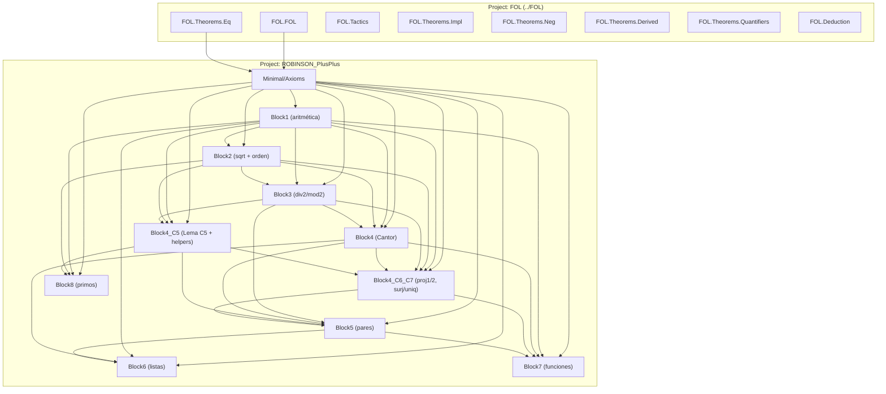

# Dependency Diagram — ROBINSON_PlusPlus

> ## ESTADO REAL — 2026-09-03 · rama A cerrada · PROMOCIÓN: B0, B0b, B9, B1, B8 hechas
>
> Estado autoritativo: **[NEXT-STEPS.md](NEXT-STEPS.md)** → **[PLAN-FRENTE-A.md](PLAN-FRENTE-A.md)**
> → [cuarentena/README.md](cuarentena/README.md) → [sondeos/README.md](sondeos/README.md).
> Catálogo de módulos y proyección: **[REFERENCE.md](REFERENCE.md)** §1 →
> [doc/REFERENCE-Incompleteness.md](doc/REFERENCE-Incompleteness.md) §3.24–§3.32.
>
> **Build 122 jobs · 0 errores · 0 warnings · 0 sorrys · Lean v4.31.0.**
> **108 módulos activos** (Minimal 11 + Meta 86 + Full 11) **+ 0 en `cuarentena/` + 57 en `sondeos/`.**
> **7 `axiom` de Lean · 141 axiomas objeto** en `axioms`.
>
> ### Reparada la inconsistencia conocida (ADR-012/013)
>
> * `ax_tc_cons` **RETIRADO** de `axioms` (hacía la teoría **inconsistente**). El `def` sigue en
>   `Minimal/Axioms.lean:827` pero **fuera de las listas** — es una definición muerta.
> * **`goedel_first_real'`, `godelC'_fixedpoint` y `goedel_first_undecidable_real'` YA NO EXISTEN.**
>   Gödel I es hoy **`goedel_first_numeral`** (`Meta/DiagonalNumeral.lean`), sobre la sentencia
>   **numeral** `godelCN`.
> * **0 módulos en `cuarentena/`** (D3 y Gödel II aún fuera de la cadena activa). NO borrados.
> * ⚠️ **NO es una prueba de consistencia**: se retiró la inconsistencia **conocida y localizada**.
>
> ### La ESCALERA (a.2) COMPLETA — 4 de 4
>
> `pcc_eval_add` → `pcc_eval_mul` → `div2` → **`pcc_dot_cons`** (`Meta/DotConsPrf.lean`): la
> Σ₁‑completitud **internalizada** para argumentos ABSTRACTOS. Rédito verificado en
> `sondeos/CarcPayoff.lean`. ▶ **PASO 1 EJECUTADO (2026-08-23)**: `EvalListPrf` repatriado, y con él
> **6 módulos más en cascada** — cuarentena **21 → 12**. ▶ **PASO 2 EJECUTADO**: `EvalNthcPrf` + `EvalCarcNthcPrf` de vuelta (cuarentena 14 → 12). ▶ **PASO 3 EJECUTADO**: `D3InDotPrf` de vuelta ⇒ **D3 reducida otra vez a UN SOLO lema**. ▶ **PASOS 4‑5 EJECUTADOS**: `LineWFTrackedPrf` y el **KIT** (`CodeCtorKit`) en producción. **LA CUARENTENA ESTÁ VACÍA.**
>
> ⚠️ **`⊬¬G` sigue SIN cerrar** en la cadena real (falta `NegVerifier`); es frente independiente.

**Last updated:** 2026-09-03 (grafo: +1 módulo, `Meta/LiftcCodePrf.lean`, con 25 imports concretos)
**Author**: Julián Calderón Almendros

Grafo de dependencias verificado contra los `import` de cada `.lean`. Sin ciclos.

> ⚠️ **Alcance (nota 2026-07-12, ampliada 2026-08-22)**: el **grafo módulo‑a‑módulo** de abajo cubre
> solo **`Minimal/`** (Axioms + Block1–8, 11 módulos). `Full/` (11 módulos) se documenta en
> [`doc/REFERENCE-Full.md`](doc/REFERENCE-Full.md). Para **`Meta/`** (86 módulos) se adopta la **vista
> de subsistema** que esta nota pedía — ver §0 justo debajo. Mantener un grafo módulo‑a‑módulo de
> `Meta/` aquí quedaría desactualizado de inmediato (`AI-GUIDE.md` §0.5); el detalle por módulo vive
> en [`doc/REFERENCE-Incompleteness.md`](doc/REFERENCE-Incompleteness.md) §3.15–§3.25 y el catálogo
> completo en [`REFERENCE.md`](REFERENCE.md) §1.5.

---

## 0 · `Meta/` — vista de subsistema (verificada 2026-08-22 23:55)

Extraída **por máquina** de los `import` reales de los módulos activos de `Meta/`; el nivel es la
**longitud del camino más largo** hasta una raíz. **25 niveles, sin ciclos.**

| nivel | subsistema | módulos |
|---|---|---|
| L0–L2 | **cálculo finitario + Nivel B/C** | `Hilbert`, `Godel`, `CodeDecode` · `HilbertDeduction`, `Provability`, `CodeArith` · `HilbertSeq`, `SubstArith`, `CodeDistinct` |
| L3–L5 | **aritmetización del verificador** | `StepArith` · `CheckArith`, `Induction` · `ProofChain`, `ListInductionArith` |
| L6–L8 | **representabilidad + capa ω** | `Representability` · `Necessitation`, **`ReprPrf`** · `ArithPrf`, `ChainPrf`, `Diagonal`, `NumListPrf`, `LineWFDerives`, `AxiomListCode` |
| L9–L12 | **D1/D2 sobre `Prf` + aritmética en `Prf`** | `Representability2`, `DerivCond`, `TcArithPrf`, `SubstCodeOpenPrf`, `NatArithPrf` · `Representability2Prf`, `NumCodeClosedPrf`, `Reflection`, `BoundedInPrf`, `ChainDecode`, `DiagonalTwo`, `NatOrderPrf` · `DerivCondPrf`, `GodelTwo`, `NatMulPrf`, `RunFnBoundedPrf` · `ReflectionPrf`, `ChainOkBoundedPrf`, `CantorMonoPrf` |
| L13–L16 | **LA REPARACIÓN** (ADR‑012) | `Sigma1Prf`, `LineWFConsPrf`, `StrongInductionPrf` · `Div2ParityPrf`, `Sigma1BoundedPrf` · **`CodeNumeralPrf`** · **`DiagonalNumeral`**, **`Sigma1CorePrf`** |
| L17–L21 | **sistema de prueba interno a nivel de código** | `ExIntroCodePrf`, `LineWFCases`, `OmegaReflect` · `Sigma1TrackedPrf` · `TrackedCorePrf` · `ForallElimCodePrf`, `Sigma1AtomPrf` · **`MpCodePrf`** |
| L22–L24 | **LA ESCALERA (a.2)** | **`EvalArithPrf`** → **`EvalMulPrf`** → **`DotConsPrf`** |
| L25–L28 | **REPATRIADOS** (2026-08-23, paso 1) | **`EvalListPrf`** → `EvalLtPrf`, `EvalRunFnPrf` → `EvalBoundedPrf`, `Delta0ReflectPrf`, `PropCodePrf` → **`D3DottedPrf`** |

**Hechos estructurales medidos:**

* **`DotConsPrf` (L24) era el módulo más profundo del proyecto** hasta la repatriación del 2026-08-23, que apiló encima `EvalListPrf` y su cascada. La escalera se apoya, en cadena,
  sobre absolutamente todo lo anterior — por eso no se pudo ni *enunciar* hasta refundar
  `Sigma1CorePrf` (L16), que es lo que devolvió `MpCodePrf` (L21) de la cuarentena.
* **`ReprPrf` (L7) es el módulo de mayor *fan‑in* directo** (7 dependientes), seguido de
  `Representability`, `Hilbert` (5) y `Representability2`, `ArithPrf` (4). Son los puntos donde un
  cambio de enunciado se propaga más.
* **Hojas** (nadie las importa, son los frentes): `DotConsPrf`, `GodelTwo`, `ChainDecode`,
  `OmegaReflect`, `LineWFCases`, `LineWFConsPrf`, `Sigma1BoundedPrf`.

### `cuarentena/` — VACÍA

No participan del grafo anterior. **6 raíces** (tras los pasos 1 y 2 del 2026-08-23):
`D3InDotPrf` (desbloquea 11) · `LineWFTrackedPrf` (8) · `CodeCtorKit` (4) · `CodeTreeReflect` (2) ·
`InAxiomsCodePrf` (2) · `LineWFEfqPrf` (1). Grafo interno en [`cuarentena/README.md`](cuarentena/README.md).

### `sondeos/` — 10 experimentos compilados a mano

Fuera del `lake build` (se compilan con `lake env lean sondeos/X.lean`). Catálogo en
[`sondeos/README.md`](sondeos/README.md).

---

## Project Structure (`Minimal/` — ver nota de alcance arriba)

```text
ROBINSON_PlusPlus/                  # raíz del proyecto Lean
├── ROBINSON_PlusPlus.lean          # Barrel: importa todos los módulos
├── lakefile.lean                   # require FOL from "../FOL"
├── _template.lean                  # Plantillas (no importadas)
├── Minimal_template.lean
├── Intermediate_template.lean
├── Full_template.lean
└── ROBINSON_PlusPlus/Minimal/
    ├── Axioms.lean                 # Lenguaje + 141 axiomas objeto + esquemas del verificador
    └── Theorems/
        ├── Block1.lean             # Aritmética básica + teo_2_11 (cancelación *2)
        ├── Block2.lean             # Raíz cuadrada, sqrt_*, succ_le_of_lt, le/lt-trans
        ├── Block3.lean             # div2/mod2 enumerado por numeral (1918 LOC, sin inducción)
        ├── Block4.lean             # Cantor: parity_lemma, cantor_totality, cantor_injective_c
        ├── Block4_C5.lean          # Lema C5 + ~25 helpers de orden/aritmética
        ├── Block4_C6_C7.lean       # add_left_cancel, mod2_of_even, proj1/proj2, Cantor surj/uniq
        ├── Block5.lean             # Pares: proj1/2_pair, pair_proj_eq_c, pair_inj
        ├── Block6.lean             # Listas: cons_neq_nil, concat_assoc (vía ax_C3), in_concat (vía ax_L3)
        ├── Block7.lean             # Funciones: IsFunction, Functional, F1/F2/F3 (meta-Prop Lean)
        └── Block8.lean             # Primos + factorización: Dvd, IsPrime, IsFactorization, pow/prod_pairs, Ax-P (TFA)
```

---

## Dependency Graph (Mermaid)



> **Nota**: las flechas reflejan `import` directos extraídos de las cabeceras de cada `.lean`. Algunos módulos importan transitivamente (e.g. `Block6` importa `Block5` y de ahí obtiene todo lo que `Block5` reexporta).

---

## Namespace Hierarchy

```text
ROBINSON_PlusPlus
└── Minimal
    ├── Axioms
    └── Theorems
        ├── Block1
        ├── Block2
        ├── Block3
        ├── Block4
        ├── Block4_C5
        ├── Block4_C6_C7
        ├── Block5
        ├── Block6
        ├── Block7
        └── Block8
```

Mapping 1:1 entre rutas de archivo y namespaces (ADR-005).

---

## Dependencies by Level

### Level 0 — Foundation

* `FOL.*` (proyecto sibling, dependencia local vía `lakefile.lean`).
* `Minimal/Axioms.lean` — lenguaje + **141 axiomas objeto** (`def axioms`, línea 1199) + los esquemas del verificador + la capa Δ₀ (`lenc`/`nthc`). Solo importa `FOL.FOL` y `FOL.Theorems.Eq`.
  ⚠️ Las **6 meta-reglas ω** (`imp_intro`, `gen`, `raa`, `or_elim`, `ex_elim`, `dne`) **ya no viven aquí**: se movieron a `FOL/MetaRules.lean` y se re-exportan (ADR-010).

### Level 1 — Aritmética básica

* `Block1.lean` — depende de `Axioms` + `FOL.Tactics`.

### Level 2 — Estructuras de orden y aritmética derivada

* `Block2.lean` — `Axioms`, `Block1`.
* `Block3.lean` — `Axioms`, `Block1`, `Block2`.

### Level 3 — Cantor (paridad + totalidad/inyectividad)

* `Block4.lean` — `Axioms`, `Block1`, `Block3`.

### Level 4 — Lema C5 (extracción de `w`)

* `Block4_C5.lean` — `Axioms`, `Block1`, `Block2`, `Block3`.

### Level 5 — Sobreyectividad y unicidad Cantor (proj1/proj2 concretos)

* `Block4_C6_C7.lean` — `Axioms`, `Block1`, `Block2`, `Block3`, `Block4`, `Block4_C5`.

### Level 6 — Pares (Bloque V)

* `Block5.lean` — `Axioms`, `Block1`, `Block3`, `Block4`, `Block4_C5`, `Block4_C6_C7`.

### Level 7 — Listas, funciones, primos

* `Block6.lean` — `Axioms`, `Block1`, `Block4`, `Block5`.
* `Block7.lean` — `Axioms`, `Block1`, `Block4`, `Block4_C6_C7`, `Block5`.
* `Block8.lean` — `Axioms`, `Block1`, `Block2`, `Block4_C5`.

### Level N — Barrel

* `ROBINSON_PlusPlus.lean` — `import` de los 11 módulos anteriores.

---

## Notable cross-module facts

* **`mod2_of_even` vive en `Block4_C6_C7`** (no en `Block5`) desde 2026-06-03: `proj_is_cantor` (en C6_C7) lo necesita, y `Block5` importa C6_C7 — moverlo evita la dependencia circular.
* **`proj1`/`proj2`** son defs concretas (`x_of_c`/`y_of_c`) en `Block4_C6_C7`, no símbolos opacos en `Axioms`. Sustituyen al eliminado `ax22`.
* **`add_left_cancel`** en `Block4_C6_C7` reemplaza al eliminado `ax27`. La prueba PA⁻ usa `lt_add_const_of_le_left` (de `Block4_C5`) + `add_comm'` (también `Block4_C5`) + `ax18`/`ax19`.
* **`succ_le_of_lt`** en `Block2` se refactorizó para no usar ax27 (vía `ax5+ax3 → a+(σkp+k)=a; ax13` con testigo → `lt a a` → contradice `ax18`).
* **`teo_2_11`** en `Block1` reemplaza al eliminado `ax28`. Prueba: tricotomía + `mul_two_lt_mono` (en Block1) + `ax18`.

---

## Exports by Module

Ver los nodos temáticos [`doc/REFERENCE-Kernel.md`](doc/REFERENCE-Kernel.md) /
[`REFERENCE-Arithmetic.md`](doc/REFERENCE-Arithmetic.md) (§3.1–§3.11) para listas completas de exports
por módulo. Resumen:

| Módulo | # defs públicas | # teoremas exportados |
|---|---:|---:|
| `Axioms` | 85 | 13 |
| `Block1` | 3 | 31 |
| `Block2` | 1 | 13 |
| `Block3` | 1 | 11 |
| `Block4` | 2 | 8 |
| `Block4_C5` | 2 | 35 |
| `Block4_C6_C7` | 6 | 5 |
| `Block5` | 1 | 5 |
| `Block6` | 1 | 7 |
| `Block7` | 3 | 3 |
| `Block8` | 3 | 5 |

---

## Design Notes

1. **Separation of concerns**: un módulo ↔ un bloque temático de la spec `TuplasFuncionesYListas.md`.
2. **Minimal dependencies**: cada módulo importa solo lo estrictamente necesario; `open` selectivo.
3. **Selective exports**: cada módulo termina con un bloque `export` que enumera su API pública.
4. **Sin Mathlib** (ADR-001): solo `FOL` como dependencia externa.
5. **One namespace per module** (ADR-005): mirrors file path.
6. **6 meta-reglas ω** (ADR-010): `imp_intro`, `gen`, `raa`, `or_elim`, `ex_elim`, `dne` — meta-teoremas válidos en aritmética, no derivables como reglas FOL puras. Viven en `FOL/MetaRules.lean`, re-exportadas desde `Minimal.Axioms`.

---

## Verification Commands

```bash
lake build                              # build completo (122 jobs a 2026-08-31)
lake clean                              # reinicia la caché (cuando `Replayed` esconde errores)
lake env lean sondeos/X.lean            # compila un sondeo (fuera del build)
lake env lean Probe/X.lean              # scratch de sesión (Probe/ está en .gitignore)
```

⚠️ **`lake build` puede dar VERDE sin construir lo que crees.** La `lean_lib` sólo construye lo
**alcanzable desde el módulo raíz**: mover un fichero a `Meta/` sin añadir su `import` en
`Meta.lean` lo deja **fuera del build**, y el build sale verde. **Señal de alarma: el número de jobs
no cambia al añadir módulos.** Comprobar siempre que el conteo se mueve.

⚠️ **NUNCA `cd FOL && lake build`** — desajuste de toolchain. Compilar siempre desde la raíz de RPP.
