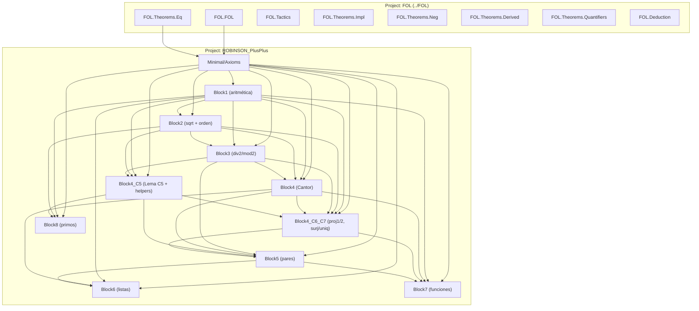

# Dependency Diagram — ROBINSON_PlusPlus

**Last updated:** 2026-06-05
**Author**: Julián Calderón Almendros

Grafo de dependencias verificado contra los `import` de cada `.lean`. Sin ciclos.

---

## Project Structure

```text
ROBINSON_PlusPlus/                  # raíz del proyecto Lean
├── ROBINSON_PlusPlus.lean          # Barrel: importa todos los módulos
├── lakefile.lean                   # require FOL from "../FOL"
├── _template.lean                  # Plantillas (no importadas)
├── Minimal_template.lean
├── Intermediate_template.lean
├── Full_template.lean
└── ROBINSON_PlusPlus/Minimal/
    ├── Axioms.lean                 # Lenguaje + 30 axiomas + 5 meta-axiomas FOL (ADR-008)
    └── Theorems/
        ├── Block1.lean             # Aritmética básica + teo_2_11 (cancelación *2)
        ├── Block2.lean             # Raíz cuadrada, sqrt_*, succ_le_of_lt, le/lt-trans
        ├── Block3.lean             # div2/mod2 enumerado por numeral (1918 LOC, sin inducción)
        ├── Block4.lean             # Cantor: parity_lemma, cantor_totality, cantor_injective_c
        ├── Block4_C5.lean          # Lema C5 + ~25 helpers de orden/aritmética
        ├── Block4_C6_C7.lean       # add_left_cancel, mod2_of_even, proj1/proj2, Cantor surj/uniq
        ├── Block5.lean             # Pares: proj1/2_pair, pair_proj_eq_c, pair_inj
        ├── Block6.lean             # Listas: cons_neq_nil, concat_assoc (vía ax_C3), in_concat (vía ax_L3)
        ├── Block7.lean             # Funciones: IsFunction, Functional, F1/F2/F3 (meta-Prop Lean)
        └── Block8.lean             # Primos: Dvd, IsPrime, dvd_*, isPrime_*_inconsistent
```

---

## Dependency Graph (Mermaid)



> **Nota**: las flechas reflejan `import` directos extraídos de las cabeceras de cada `.lean`. Algunos módulos importan transitivamente (e.g. `Block6` importa `Block5` y de ahí obtiene todo lo que `Block5` reexporta).

---

## Namespace Hierarchy

```text
ROBINSON_PlusPlus
└── Minimal
    ├── Axioms
    └── Theorems
        ├── Block1
        ├── Block2
        ├── Block3
        ├── Block4
        ├── Block4_C5
        ├── Block4_C6_C7
        ├── Block5
        ├── Block6
        ├── Block7
        └── Block8
```

Mapping 1:1 entre rutas de archivo y namespaces (ADR-005).

---

## Dependencies by Level

### Level 0 — Foundation

* `FOL.*` (proyecto sibling, dependencia local vía `lakefile.lean`).
* `Minimal/Axioms.lean` — lenguaje + 30 axiomas + 5 meta-axiomas. Solo importa `FOL.FOL` y `FOL.Theorems.Eq`.

### Level 1 — Aritmética básica

* `Block1.lean` — depende de `Axioms` + `FOL.Tactics`.

### Level 2 — Estructuras de orden y aritmética derivada

* `Block2.lean` — `Axioms`, `Block1`.
* `Block3.lean` — `Axioms`, `Block1`, `Block2`.

### Level 3 — Cantor (paridad + totalidad/inyectividad)

* `Block4.lean` — `Axioms`, `Block1`, `Block3`.

### Level 4 — Lema C5 (extracción de `w`)

* `Block4_C5.lean` — `Axioms`, `Block1`, `Block2`, `Block3`.

### Level 5 — Sobreyectividad y unicidad Cantor (proj1/proj2 concretos)

* `Block4_C6_C7.lean` — `Axioms`, `Block1`, `Block2`, `Block3`, `Block4`, `Block4_C5`.

### Level 6 — Pares (Bloque V)

* `Block5.lean` — `Axioms`, `Block1`, `Block3`, `Block4`, `Block4_C5`, `Block4_C6_C7`.

### Level 7 — Listas, funciones, primos

* `Block6.lean` — `Axioms`, `Block1`, `Block4`, `Block5`.
* `Block7.lean` — `Axioms`, `Block1`, `Block4`, `Block4_C6_C7`, `Block5`.
* `Block8.lean` — `Axioms`, `Block1`, `Block2`, `Block4_C5`.

### Level N — Barrel

* `ROBINSON_PlusPlus.lean` — `import` de los 11 módulos anteriores.

---

## Notable cross-module facts

* **`mod2_of_even` vive en `Block4_C6_C7`** (no en `Block5`) desde 2026-06-03: `proj_is_cantor` (en C6_C7) lo necesita, y `Block5` importa C6_C7 — moverlo evita la dependencia circular.
* **`proj1`/`proj2`** son defs concretas (`x_of_c`/`y_of_c`) en `Block4_C6_C7`, no símbolos opacos en `Axioms`. Sustituyen al eliminado `ax22`.
* **`add_left_cancel`** en `Block4_C6_C7` reemplaza al eliminado `ax27`. La prueba PA⁻ usa `lt_add_const_of_le_left` (de `Block4_C5`) + `add_comm'` (también `Block4_C5`) + `ax18`/`ax19`.
* **`succ_le_of_lt`** en `Block2` se refactorizó para no usar ax27 (vía `ax5+ax3 → a+(σkp+k)=a; ax13` con testigo → `lt a a` → contradice `ax18`).
* **`teo_2_11`** en `Block1` reemplaza al eliminado `ax28`. Prueba: tricotomía + `mul_two_lt_mono` (en Block1) + `ax18`.

---

## Exports by Module

Ver `REFERENCE.md` §3.1–§3.11 para listas completas de exports por módulo. Resumen:

| Módulo | # defs públicas | # teoremas exportados |
|---|---:|---:|
| `Axioms` | 85 | 13 |
| `Block1` | 3 | 31 |
| `Block2` | 1 | 13 |
| `Block3` | 1 | 11 |
| `Block4` | 2 | 8 |
| `Block4_C5` | 2 | 35 |
| `Block4_C6_C7` | 6 | 5 |
| `Block5` | 1 | 5 |
| `Block6` | 1 | 7 |
| `Block7` | 3 | 3 |
| `Block8` | 3 | 5 |

---

## Design Notes

1. **Separation of concerns**: un módulo ↔ un bloque temático de la spec `TuplasFuncionesYListas.md`.
2. **Minimal dependencies**: cada módulo importa solo lo estrictamente necesario; `open` selectivo.
3. **Selective exports**: cada módulo termina con un bloque `export` que enumera su API pública.
4. **Sin Mathlib** (ADR-001): solo `FOL` como dependencia externa.
5. **One namespace per module** (ADR-005): mirrors file path.
6. **5 meta-axiomas en Axioms** (ADR-008): `imp_intro`, `gen`, `raa`, `or_elim`, `ex_elim` — meta-teoremas válidos en aritmética, no derivables como reglas FOL puras.

---

## Verification Commands

```bash
lake build           # full project build (23 jobs)
lake clean           # reset cache (use when `Replayed` hides errors)
```
