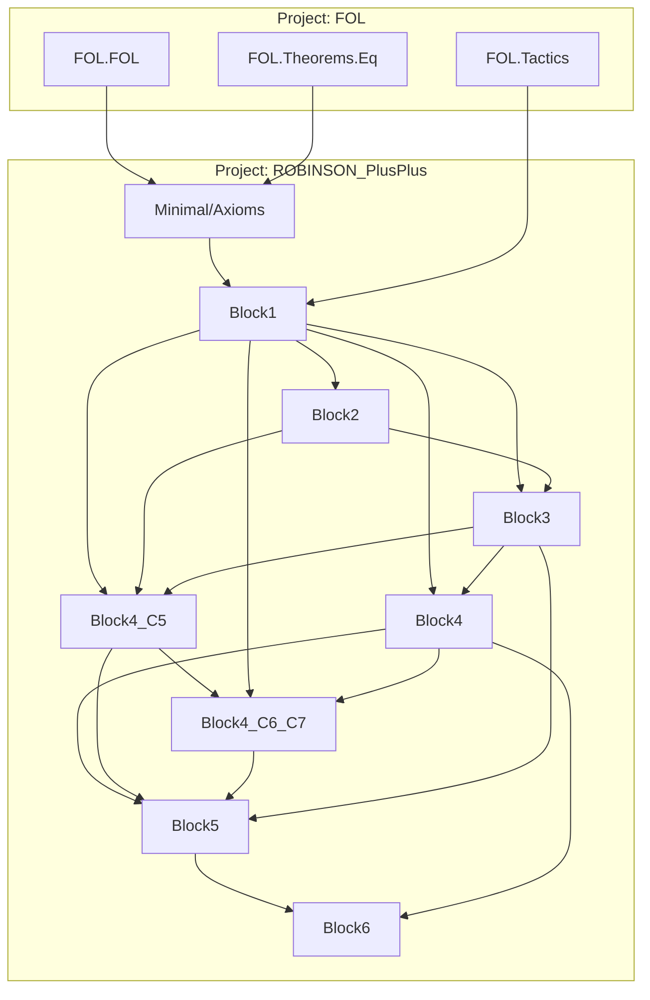

# Technical Reference — ROBINSON_PlusPlus

> ## ESTADO REAL — 2026-08-31 · 🏁 rama A CERRADA: `pcc_eval_substfc` + no-vacuidad (vía CERO axiomas)
>
> **Build 120 jobs · 0 errores · 0 warnings · 0 sorrys · Lean v4.31.0.**
> **106 módulos activos** (Minimal 11 + Meta 84 + Full 11) **+ 0 en `cuarentena/`** (fuera del build)
> **+ 57 en `sondeos/`** (experimentos compilados, fuera del build).
> **7 `axiom` de Lean** ([`AXIOMS.md`](AXIOMS.md)) · **141 axiomas objeto** en `axioms`.
>
> ### ✅ La inconsistencia conocida está REPARADA ([ADR‑012](DECISIONS.md))
>
> `ax_tc_cons` **retirado** de `axioms`: obligaba a `tcFn` a recurrir a la vez sobre estructura
> NUMERAL y sobre estructura de CÓDIGO — imposible, porque en ℕ el mismo valor es ambas cosas
> (`cons 0 nil = 2 = σσ0`). Los códigos de Gödel se escriben ahora como **NUMERALES**.
>
> * **`goedel_first_real'`, `godelC'_fixedpoint` y `goedel_first_undecidable_real'` YA NO EXISTEN.**
>   Gödel I es hoy **`goedel_first_numeral`** (`Meta/DiagonalNumeral.lean`), sobre `godelCN`.
> * **21 módulos a `cuarentena/`** ([ADR‑013](DECISIONS.md)) — cifra histórica del momento de la
>   reparación; hoy la cuarentena está **VACÍA** (§1.6). Sus teoremas eran formalmente correctos pero **vacuos**.
> * ⚠️ **NO es una prueba de consistencia**: se retiró la inconsistencia **conocida y localizada**.
>
> ### ✅ La ESCALERA (a.2) está COMPLETA — 4 de 4
>
> `pcc_eval_add` → `pcc_eval_mul` → `div2` → **`pcc_dot_cons`** (`Meta/DotConsPrf.lean`): la
> Σ₁‑completitud **internalizada** para argumentos abstractos, que es lo que repatría la cuarentena.
> Rédito verificado en `sondeos/CarcPayoff.lean` (`pcc_eval_carc` vuelve). Detalle en
> [Incompletitud §3.24–§3.32](doc/REFERENCE-Incompleteness.md).
>
> **Punto de reanudación:** **[NEXT-STEPS.md](NEXT-STEPS.md)** → **[PLAN-FRENTE-A.md](PLAN-FRENTE-A.md)**
> → [cuarentena/README.md](cuarentena/README.md) → [sondeos/README.md](sondeos/README.md).

**Last updated:** 2026-08-31 · HEAD `7be9ee8` · Lean v4.31.0 — 🏁 rama A cerrada · B0b hecha: el vocabulario del frente ya está en producción

> **El historial detallado vive en [`CHANGELOG.md`](CHANGELOG.md)**, no aquí. Este índice describe
> el **estado actual**; la línea de "Last updated" dejó de ser un volcado acumulativo el
> 2026-08-22 (había crecido a ~20 KB en una sola línea, ilegible y sistemáticamente desfasada).

**Author**: Julián Calderón Almendros
**Lean version**: v4.31.0

---

## 0 · Naming Conventions Guide for the Reader

This project adopts [Mathlib](https://leanprover-community.github.io/contribute/naming.html)-style naming conventions. See `NAMING-CONVENTIONS.md` for the full reference and 12 formation rules.

### 0.1 Capitalization

- **Theorems/lemmas** (Prop): `snake_case` — `teo_2_7`, `mul_two_lt_mono`, `cantor_uniqueness`
- **Prop definitions** (predicates): `UpperCamelCase` — `IsFunction` (planned in Block7)
- **Functions/values**: `lowerCamelCase` — `pair`, `cantor_func`, `w_candidate`
- **Axioms**: `axNN_descriptor` or `ax_TagDescriptor` — `ax13_lt_def`, `ax_L0_cons_def`

### 0.2 Symbol-to-Word Dictionary

| Symbol | Name | | Symbol | Name | | Symbol | Name |
|--------|------|---|--------|------|---|--------|------|
| ∈ | `mem` / `In` | | + | `add` | | σ | `succ` |
| = | `eq` | | * | `mul` | | τ | `pred` |
| ≠ | `ne` | | − | `sub` | | √ | `sqrt` |
| ≤ | `le` | | / | `div` | | 0 | `zero` |
| < | `lt` | | ^ | `pow` | | 1 | `one` |
| ¬ | `not` / `neg` | | ∣ | `dvd` | | 2 | `two` |
| ⇔ | `iff` | | ↔ | `iff` | | ∅ | `empty` |
| ⇒ | `imp` (impl) | | ∨ | `lor` (or) | | ∧ | `land` (and) |

---

## 1 · Catálogo de módulos (índice raíz)

**El detalle exhaustivo (firmas Lean 4, dependencias por módulo, notación) vive en los nodos
temáticos `doc/REFERENCE-*.md`.** Esta tabla es el catálogo raíz; cada grupo enlaza a su nodo (árbol
REFERENCE, `AI-GUIDE.md` §0.5).

**106 módulos activos** (Minimal 11 + Meta 84 + Full 11) + barrel `Meta.lean` + raíz
`ROBINSON_PlusPlus.lean`. Fuera del build: **0 en `cuarentena/`** (§1.6) y **57 en `sondeos/`**
(experimentos compilados a mano; catálogo en [`sondeos/README.md`](sondeos/README.md)).

### 1.1 Núcleo → [`doc/REFERENCE-Kernel.md`](doc/REFERENCE-Kernel.md)

| Module | Namespace | Dependencies | Status |
|--------|-----------|--------------|--------|
| `Minimal/Axioms.lean` | `…Minimal.Axioms` | `FOL.FOL`, `FOL.Theorems.Eq` | ✅ Complete (Q++ + esquemas verificador + capa Δ₀ `lenc`/`nthc`/`ax_lineWF_inv`/`ax_lineWF_cons`) |

### 1.2 Aritmética desarrollada → [`doc/REFERENCE-Arithmetic.md`](doc/REFERENCE-Arithmetic.md)

| Module | Namespace | Dependencies | Status |
|--------|-----------|--------------|--------|
| `Minimal/Theorems/Block1.lean` | `…Block1` | `Axioms`, `FOL.Tactics` | ✅ Complete |
| `Minimal/Theorems/Block2.lean` | `…Block2` | `Axioms`, `Block1` | ✅ Complete |
| `Minimal/Theorems/Block3.lean` | `…Block3` | `Axioms`, `Block1`, `Block2` | ✅ Complete |
| `Minimal/Theorems/Block4.lean` | `…Block4` | `Axioms`, `Block1`, `Block3` | ✅ Complete |
| `Minimal/Theorems/Block4_C5.lean` | `…Block4_C5` | `Axioms`, `Block1`–`Block3` | ✅ Complete |
| `Minimal/Theorems/Block4_C6_C7.lean` | `…Block4_C6_C7` | `Axioms`, `Block1`–`Block4_C5` | ✅ Complete |
| `Minimal/Theorems/Block5.lean` | `…Block5` | `Axioms`, `Block1`–`Block4_C6_C7` | ✅ Complete |
| `Minimal/Theorems/Block6.lean` | `…Block6` | `Axioms`, `Block1`, `Block4`, `Block5` | ✅ Complete |
| `Minimal/Theorems/Block7.lean` | `…Block7` | `Axioms`, `Block1`, `Block4`, `Block4_C6_C7`, `Block5` | ✅ Complete |
| `Minimal/Theorems/Block8.lean` | `…Block8` | `Axioms`, `Block1`, `Block2`, `Block4_C5` | ✅ Complete (Fase 17 + Ax-P TFA) |

### 1.3 Gödelización Nivel B/C → [`doc/REFERENCE-Godelization.md`](doc/REFERENCE-Godelization.md)

| Module | Namespace | Dependencies | Status |
|--------|-----------|--------------|--------|
| `Meta/Godel.lean` | `…Meta.Godel` | `Axioms`, `Block6` | ✅ Nivel B: `G`, `⌜·⌝`, Teo G1 |
| `Meta/Provability.lean` | `…Meta.Provability` | `Axioms`, `Meta.Godel`, `FOL.*` | ✅ Nivel C: `formCode`, `IsFormula`, `Provable` (legacy retirada en F7a) |

### 1.4 Sistema `Full/` → [`doc/REFERENCE-Full.md`](doc/REFERENCE-Full.md)

| Module | Namespace | Dependencies | Status |
|--------|-----------|--------------|--------|
| `Full/Induction.lean` | `…Full` | `Axioms`, `FOL.*` | ✅ `ax_induction`/`inductionFormula` (+ ax6/7/10/11/12/18/19) |
| `Full/Mod2.lean` | `…Full` | `Axioms`, `Block1`, `Full.Induction` | ✅ ax21/ax24 |
| `Full/Lists.lean` | `…Full` | `Axioms`, `Full.Induction` | ✅ `ax_list_induction` (ax_C3/ax_L3) |
| `Full/StrongInduction.lean` | `…Full` | `Axioms`, `Full.Induction` | ✅ inducción fuerte derivada |
| `Full/Numerals.lean` | `…Full` | `Axioms`, `Block1`, `Full.Induction` | ✅ puente `numeral` + homomorfismo |
| `Full/Bounded.lean` | `…Full` | `Axioms`, `Full.{Induction,StrongInduction,Numerals}` | ✅ `le_numeral_split` |
| `Full/Divisibility.lean` | `…Full` | `Axioms`, `Block1`, `Block8`, `Full.*` | ✅ `numeral_dvd`, `divisor_le` |
| `Full/Division.lean` | `…Full` | `Axioms`, `Full.Numerals` | ✅ `division_numeral` |
| `Full/PrimeFactor.lean` | `…Full` | (ℕ pura) | ✅ Euclides + unicidad |
| `Full/Primality.lean` | `…Full` | `Axioms`, `Block1`, `Block8`, `Full.*` | ✅ `isPrime_numeral` |
| `Full/Factorization.lean` | `…Full` | `Axioms`, `Block8`, `Full.{Numerals,PrimeFactor}` | ✅ **`tfa_numeral`** (TFA completo) |

### 1.5 Incompletitud Nivel D → [`doc/REFERENCE-Incompleteness.md`](doc/REFERENCE-Incompleteness.md)

Los **84 módulos** de `Meta/`, en el orden del barrel [`Meta.lean`](ROBINSON_PlusPlus/Meta.lean).
Detalle en el nodo §3.15–§3.32.

| # | Module | Rol · Estado |
|--:|--------|--------------|
| 1–2 | `Godel.lean` · `Provability.lean` | Nivel B/C — ver §1.3 |
| 3–5 | `Hilbert.lean` · `HilbertDeduction.lean` · `HilbertSeq.lean` | F0/F1: `Prf₀`/`Prf` + puentes (`dne` aislado); deducción finitaria `PrfH`; `checkProof`, `Dem`, `dem_tracks` |
| 6–9 | `CodeArith.lean` · `SubstArith.lean` · `StepArith.lean` · `CheckArith.lean` | F2.1–2.4: aritmética de códigos, sustitución/lift De Bruijn, `validProofFn` (19 reglas) + `provCodeC` Σ₁ |
| 10–12 | `Representability.lean` · `Necessitation.lean` · `Diagonal.lean` | F2.5–F3: `repr_pos`, D1/`necessitation`, `diag_arith`, `tc_numeral` |
| 13–15 | `CodeDistinct.lean` · `Induction.lean` · `ListInductionArith.lean` | aritmética negativa `formCode_ne`/`strCode_ne`; reglas `ind`/`listInd` (IΣ₁) |
| 16 | `ProofChain.lean` | verificador estructural `runFn`/`chainOk`/`lineOk`/`allIn` + `provCodeC'` |
| 17–19 | `DerivCond.lean` · `Representability2.lean` · `Reflection.lean` | **D2** `d2`, **D1** `repr_pos'`, combinadores (capa ω) |
| 20–26 | `ReprPrf` · `LineWFDerives` · `ArithPrf` · `Representability2Prf` · `ChainPrf` · `DerivCondPrf` · `ReflectionPrf` | re‑nivelación HBL a `Prf`: **D1** `repr_pos'_prf` ✅, **D2** `d2_prf` ✅, **D3 reducida** `d3_prf_of_sigma1` |
| 27–29 | `Sigma1Prf` · `TcArithPrf` · `NumListPrf` | reflexión Σ₁; `tcFn` (`prf_tc_zero`/`_succ`/**`prf_tc_numeral`**); `lenc`/`nthc` |
| 30–34 | `NatArithPrf` · `NatOrderPrf` · `NatMulPrf` · `CantorMonoPrf` · `Div2ParityPrf` | **aritmética en `Prf`**: `<` y `prf_nat_induction`; orden `≤`; producto y cancelación; **`prf_cantor_mono_left/right`**; **`prf_div2_numeral`**, **`prf_cons_double`** (§3.24.3–4) |
| 35–36 | **`CodeNumeralPrf`** · **`DiagonalNumeral`** | **LA REPARACIÓN (ADR‑012)**: `consN` por números triangulares, `codeNat`, **`prf_formCode_numeral`**; lema diagonal numeral, **`goedel_first_numeral`** (Gödel I) (§3.24.2/§3.24.5) |
| 37 | `Sigma1CorePrf` | **keystone de (a.1)**, refundado a códigos numerales (§3.24.7) |
| 38–39 | **`EvalArithPrf`** · **`EvalMulPrf`** | **escalera (a.2) 1–2**: `pcc_eval_add`, `pcc_eval_mul`; toolkit ecuacional interno (§3.25.1–2) |
| 40–47 | `ExIntroCodePrf` · `ForallElimCodePrf` · `LineWFCases` · `MpCodePrf` · `OmegaReflect` · `Sigma1AtomPrf` · `Sigma1TrackedPrf` · `TrackedCorePrf` | sistema interno a nivel de código (`pcc_axiom_inst`, **`pcc_thm_inst`**); los 21 tags; `Reflects`/`reflects_of_omega`/`NegVerifier`; átomo `=eq`; testigo rastreado |
| 48 | `StrongInductionPrf` | **inducción fuerte en `Prf`**, net‑0 y en forma OBJETO (`prf_strong_induction`) (§3.24.6) |
| 49–52 | `BoundedInPrf` · `RunFnBoundedPrf` · `ChainOkBoundedPrf` · `Sigma1BoundedPrf` | 12‑A fases 1‑3: capa Δ₀ del verificador + `d3_prf_of_reflect_bounded` |
| 53–54 | `SubstCodeOpenPrf` · `NumCodeClosedPrf` | `prf_substfc_arith_open`, `substCodeT_closed`; `prf_liftc_tcFn`, `prf_substtc_tcFn` |
| 55 | **`DotConsPrf`** | **escalera (a.2) peldaño 4 — `pcc_dot_cons`** ✅, más **`pcc_rw`** / **`pcc_rw_imp`** / `pcc_rw_div2` (§3.25.3) |
| 56–60 | **`EvalListPrf`** · `EvalLtPrf` · `EvalRunFnPrf` · `EvalBoundedPrf` · **`EvalNthcPrf`** | 🔁 **repatriados**: evaluación provable de `carc`/`cdrc`/`lenc`, `<`, `∃i<B`/`∀i<B`, `nthc`. Moldes **`pcc_rw_dot_cons_un`** y **`pcc_rw_dot_cons_nthc`** (§3.26) |
| 61–64 | `Delta0ReflectPrf` · **`D3DottedPrf`** · `PropCodePrf` · `EvalCarcNthcPrf` | 🔁 reflexión Δ₀; **`d3_prf_of_dotted_atoms`** (net‑0); §39 lógica interna (`pcc_ind_code`); `carc∘nthc` |
| 65–66 | **`D3InDotPrf`** · `BdAllIntroPrf` | 🔁 **`hI_dot`** y **`d3_prf_of_chainOkDot`** (D3 ⇐ `hC_dot` SOLO); **`prf_tc_form_numeral`** + **`pcc_to_formCode`** (§3.26.2); §40 `pcc_bdAll_intro` |
| 67–69 | **`LineWFTrackedPrf`** · `LineWFMpPrf` · `LineWFSchemaPrf` | 🔁 reflexión punteada de `lineWF`; **`pcc_dot_eqc`**; chasis `pcc_lineWF_tracked_of_schema` |
| 70–73 | **`CodeCtorKit`** · `LineWFEfqPrf` · **`CodeTreeReflect`** · `LineWFPropPrf` | 🔁 **el KIT**: `pcc_dot_nul`/`_un`/`_bin` (+ simétricas) y sus congruencias internas; **`pcc_tc_objAt`** (recursión sobre `CTree` dentro de `Prov`) (§3.26.3) |
| 74 | **`EvalPredPrf`** | 🆕 **la evaluación DOTADA de `pred`** (2026‑08‑31, promovido de `sondeos/EvalPredDot.lean`): `pcc_eval_pred (n)` con `n` **ABSTRACTO**, más `pcc_eval_varc_pred`. Lo pide `ax_substtc_var_gt`, cuya cláusula devuelve `varc (pred n)`. ⚠️ `predcT` es **DEFINICIÓN**: no se postula ninguna ecuación de recursión suya (§3.30) |
| 75 | **`CodeWitnessPrf`** | 🆕 **el vocabulario de TESTIGOS del frente `substfc`** (2026‑08‑31, promovido de `sondeos/HasWitFRealMin.lean`). Tres bloques: `SinWTs` (reconocedor de TÉRMINO con una lista, `isTC1`/`wfAll1`/`argsIn`, más `isFormCodeB2`), `ENS` (reconocedor de FÓRMULA **ecuacional** con dos listas, `isFC1`/`hasWitF`) y `HW` (**la NO‑VACUIDAD**: `prf_hasWitF_real`, net‑0 **puro**). ⚠️ Se **dedupliparon nueve** definiciones al promover (§3.31) |
| 76–78 | **`InAxiomsCodePrf`** · `LineWFThyPrf` · `LineWFAssemblePrf` | 🔁 `pcc_In_axiomsCodeT_tracked`, **`pcc_tc_formCode_internal`**; **`pcc_lineWF_tracked_modulo_7`** (§3.26.4) |
| 79–80 | `LineWFConsPrf` · `AxiomListCode` | `prf_line_is_cons`; `axiomsCodeT` concretado (`neg_In_axiomsCodeT`) |
| 81–82 | `CodeDecode` · `ChainDecode` | **módulo A de `NegVerifier`**: `decodeForm` biyección + `decodeChain_prf` |
| 83–84 | `DiagonalTwo` · `GodelTwo` | infraestructura del punto fijo; **Gödel II `goedel_second'`**, módulo `axiom d3` |

🔁 = repatriado de `cuarentena/` el 2026‑08‑23 (§3.26).
*Status codes*: ✅ Complete · 🧊 Frozen · 🔶 Partial · 🔄 In progress · ❌ Pending

### 1.6 `cuarentena/` — ✅ VACÍA

Los **31** módulos que la reparación (ADR‑012/013) apartó **han vuelto todos**, con el footprint
sancionado y **sin cambiar ningún enunciado público**. El directorio conserva sólo su `README` como
registro del episodio. Ver [`cuarentena/README.md`](cuarentena/README.md) y §3.26.

> **7 `axiom` de Lean** (tras F7a): 3 esquemas de inducción (`Full/`), TFA (`Block8.ax_p_tfa`),
> 2 anclas de codificación (`ax_axiomsCodeT_eq` / `prf_axiomsCodeT_eq`), y `d3` (único postulado
> gödeliano vivo). Inventario en **[`AXIOMS.md`](AXIOMS.md)**. Ninguna es un `sorry` (ADR‑010).
>
> ⚠️ **La mitad `⊬¬G` de Gödel I sigue SIN cerrar.** `goedel_first_undecidable_numeral` toma
> `Reflects` como hipótesis META; descargarla exige **`NegVerifier`**, cuyo plan tiene un **paso
> falso** (`canon_ne`, refutado en `sondeos/CanonNeRefuta.lean`) y necesita rediseño por numerales
> (vía verificada en `sondeos/CodeNatInj.lean`). **NO recuperar F7a.**

## 2 · Dependency Graph

---

## 3 · Descripción de módulos — mapa de nodos temáticos

El detalle por módulo (definiciones, axiomas, firmas Lean 4, notación, dependencias) **ya no vive en
este índice raíz**, sino en los cinco **nodos temáticos** (`doc/REFERENCE-*.md`). Regla del árbol
REFERENCE (`AI-GUIDE.md` §0.5): el índice raíz cataloga y navega; los nodos documentan.

| Nodo | Cubre | Secciones |
|------|-------|-----------|
| [**Núcleo**](doc/REFERENCE-Kernel.md) | `Minimal/Axioms` — teoría objeto FOL⁼ (Q++), esquemas del verificador, capa Δ₀ | §3.1 |
| [**Aritmética**](doc/REFERENCE-Arithmetic.md) | `Block1–8` — aritmética desarrollada, Cantor, pares, listas, primos/TFA objeto | §3.2–§3.11 |
| [**Gödelización**](doc/REFERENCE-Godelization.md) | `Meta/Godel`, `Meta/Provability` — Nivel B/C (`⌜·⌝`, `formCode`, `Provable`) | §3.12–§3.13 |
| [**Full**](doc/REFERENCE-Full.md) | `Full/` — inducción general, representabilidad, `numeral`, TFA | §3.14 |
| [**Incompletitud**](doc/REFERENCE-Incompleteness.md) | Nivel D: Gödel I/II, D1–D3, Σ₁‑completitud provable (12‑A), módulos A/B de `NegVerifier`, **la REPARACIÓN (§3.24), la ESCALERA (§3.25), la REPATRIACIÓN (§3.26), el FRENTE `substfc` por la vía CERO AXIOMAS (§3.27) y el DESCENSO cerrado (§3.28)** | §3.15–§3.32 |

**Navegación fuerte:** cada nodo enlaza de vuelta a este índice, a sus nodos hermanos relacionados y a
los ficheros `.lean` que documenta. El subsistema **activo** es
[Incompletitud](doc/REFERENCE-Incompleteness.md) — su **estado vivo** es **§3.28**: el frente
`substfc` por la vía de **CERO AXIOMAS**, con la partición en tres predicados (que **discrimina**),
el reflector completo, el testigo para toda fórmula, la clausura bajo `liftc` y —desde el
2026‑08‑30— el **`DESCENSO` PROBADO**, que **es** `pcc_eval_liftc` (§3.28.1). El `PHI_guarded` del
consumidor **pasa el gate** de `prf_strong_induction` sin binder nuevo.
✅ **Y desde el 2026‑08‑30 los OCHO constructores de `substfc` están CUBIERTOS** (§3.29): los cinco
mecánicos (`botc` `implc` `andc` `orc` `exc`) y los dos duros, vía `pcc_eval_substtc'` y
`pcc_eval_substtsc'`. Los tres binarios salieron con **una sola prueba**, porque
`ax_substfc_impl/_and/_or` son la misma fórmula salvo el tag (certificado por `rfl`).
⚠️ **Cubiertos ≠ ensamblado**: falta la inducción que junta los ocho casos, y todo vive en
`sondeos/` con el coste de promoción de §3.28.5 sin pagar. Ver §5.

⚠️ **§3.15–§3.23 son ANTERIORES a la reparación** (ADR‑012/013). Lo que dicen de la capa rastreada
describe fielmente el código de `cuarentena/`, pero **ese código no está en el build** y sus
enunciados cambiarán al repatriarse. §3.15 documenta un **módulo eliminado** (`Meta/Incompleteness.lean`,
borrado en F7a) y está marcado como tal.

---

## 4 · Patterns notables y deuda técnica

- **Patrón `spec + simp`**: cada axioma instanciado vía `spec h_axN t` requiere un `simp` con simp-set propio según los binders del axioma. Para axiomas `forall_2` se necesita `liftTerm`/`FOL.substTerm_liftTerm`; para `forall_3`, además `FOL.substTerm_liftLift`. Ver `THOUGHTS.md` y `feedback_build_cache` en memoria de Claude.
- **`Γ` por módulo**: cada módulo define `def Γ := axioms`. La unificación entre `Block2.Γ` y `Block4_C5.Γ` falla con `apply` pero pasa con `exact` (defeq).
- **`=eq` no-estándar `eq_trans`**: `eq_trans (h1:a=b)(h2:a=c):b=c`. Para `a=b, b=c → a=c` usar `FOL.derive_eq_trans`.
- **Linter `unusedSimpArgs` desactivado** en todos los módulos (2026-06-06): `set_option linter.unusedSimpArgs false` global. Previamente se hizo un barrido a `true` (411 → 0 warnings), que confirmó qué args de `simp` eran innecesarios; tras ello se decidió dejar el linter en `false` (puede dar falsos positivos bajo binders existenciales y se prefiere libertad para conservar args de `simp` por robustez). El build permanece con 0 warnings.

---

## 5 · Próximos pasos

Punto de reanudación: **[NEXT-STEPS.md](NEXT-STEPS.md)** → **[PLAN-FRENTE-A.md](PLAN-FRENTE-A.md)**.
Visión a largo plazo: [PLANNING.md](PLANNING.md). Libro: [PLAN-LIBRO.md](PLAN-LIBRO.md).

**Estado 2026-08-31.** Build **120 jobs**, **106 módulos activos**, **57 `sondeos/`**, 0 sorrys,
7 `axiom` de Lean.

### Lo que está cerrado

1. **Gödel I — `⊬G`**: `goedel_first_numeral (hcon : ConsistentOmega) : ¬ Prf godelCN`
   (`Meta/DiagonalNumeral.lean`), sobre el punto fijo real `godelCN_fixedpoint`. Footprint = la base
   sancionada **menos `tc_cons`**.
2. **D1** ✅ `repr_pos'_prf` y **D2** ✅ `d2_prf` — reales, sobre el cálculo finitario `Prf`.
3. **La ESCALERA (a.2)** ✅ **4 de 4** (§3.25): `pcc_eval_add`, `pcc_eval_mul`, el atajo de `div2`, y
   **`pcc_dot_cons`**. Es la Σ₁‑completitud internalizada para argumentos abstractos.

### Los tres frentes abiertos — **todos MEDIDOS** (frente 1 actualizado 2026‑08‑30)

| # | frente | estado | qué lo bloquea |
|--:|---|---|---|
| **1** | **muro de `substfc`** → `hC_dot` → **D3** → Gödel II → F7b | los 7 reflectores (`q1 q2 q3 leibniz ind qconf listInd`). ✅ `prf_strong_induction` existe, net‑0 y en forma OBJETO. ✅ **La decisión ya está tomada: vía (2), CERO axiomas** ([ADR‑015](DECISIONS.md)) ⇒ la objeción de conservatividad **dejó de aplicar**. ✅ Partición en tres · reflector completo · testigo para toda fórmula · **`pcc_eval_liftc` PROBADO** (§3.28) | 🏁 **`pcc_eval_substfc` PROBADO** (§3.30, CONFIRMADO, net‑0 sobre la base sancionada) — el ensamblaje **está hecho**. ✅ **y su no‑vacuidad** (§3.31, net‑0 PURO). ⛔ La «guarda sobre argumento ABSTRACTO» se **retira del árbol: es IMPOSIBLE** y está refutada. ⚠️ Queda la **promoción a `Meta/`** (§3.28.5), cuyo primer trozo es barato y está medido (§3.31.4) |
| **2** | **`NegVerifier`** → `⊬¬G` | ⛔ el paso 1.1 del plan (`canon_ne`) es **FALSO** y reintroduciría la inconsistencia (`sondeos/CanonNeRefuta.lean`). ✅ La salida por **numerales** está verificada y es **net‑0** (`sondeos/CodeNatInj.lean`: `consN_inj` → `codeNat_inj` → `codeNat_ne`) | elegir la **representación numeral de las LÍNEAS** y rediseñar los módulos C y D |
| **3** | **recodificar símbolos por índice** | 📏 medido (`sondeos/RecodCoste.lean`): el **98‑99 %** del `formCode` de los axiomas del verificador son los nombres de símbolos (`ax_tc_zero`: 49 015 → ~708 nodos, **69×**). Pero **hoy no es cuello de botella** | nada. ⚠️ Una tabla pura **no es total** (`Term.func` toma String arbitrario) ⇒ codificación **etiquetada**. Coste: ~10 teoremas en 4 módulos, uno `CodeDecode` (completo) |

**Secuencia que sale de las mediciones:** (3) sólo tiene sentido **antes** de (2) —el rediseño de C‑F
toca la codificación de todos modos—. ⚠️ **La frase «(1) cuesta axiomas, es decisión del autor» ya
NO vale** (era de 2026‑08‑23): desde ADR‑015 el frente 1 va por la **vía de CERO axiomas** y es un
**paso técnico**, no una decisión pendiente. La razón de fondo está en §3.27.1: la opción de
axiomatizar **no era más cara, era OTRO TEOREMA** — sus axiomas entrarían en `axioms`,
`ax_axiomsCodeT_eq` los metería en `axiomsCodeT` y **G cambiaría**.

### Alternativa siempre disponible

Consolidar **Gödel II módulo el axioma D3** (`goedel_second'`, ya montado). El estado actual ya es
publicable: Gödel I `⊬G` real sobre una teoría de la que se ha retirado la inconsistencia conocida,
más D1 y D2 reales. D3 es notoriamente la pieza más dura de Gödel II también en Isabelle/Coq.

---

**Author**: Julián Calderón Almendros
