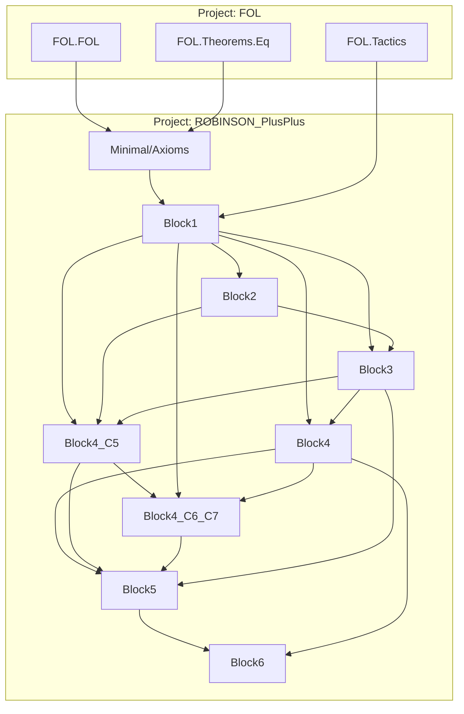

# Technical Reference — ROBINSON_PlusPlus

**Last updated:** 2026-06-03 — `Minimal/` a 0 sorrys reales; `ax27` eliminado (derivable en PA⁻ vía tricotomía + monotonía + ax18); `ax22`/`ax23` eliminados (proj1/proj2 son defs concretas; `proj_is_cantor` reemplaza ax22 como teorema); `ax28` eliminado (derivado en `teo_2_11`); sistema actual con **30 axiomas matemáticos** (23 aritméticos + 7 de listas) + 5 meta-reglas FOL.
**Author**: Julián Calderón Almendros
**Lean version**: v4.29.1

---

## 0 · Naming Conventions Guide for the Reader

This project adopts [Mathlib](https://leanprover-community.github.io/contribute/naming.html)-style naming conventions. See `NAMING-CONVENTIONS.md` for the full reference and 12 formation rules.

### 0.1 Capitalization

- **Theorems/lemmas** (Prop): `snake_case` — `teo_2_7`, `mul_two_lt_mono`, `cantor_uniqueness`
- **Prop definitions** (predicates): `UpperCamelCase` — `IsFunction` (planned in Block7)
- **Functions/values**: `lowerCamelCase` — `pair`, `cantor_func`, `w_candidate`
- **Axioms**: `axNN_descriptor` or `ax_TagDescriptor` — `ax13_lt_def`, `ax_L0_cons_def`

### 0.2 Symbol-to-Word Dictionary

| Symbol | Name | | Symbol | Name | | Symbol | Name |
|--------|------|---|--------|------|---|--------|------|
| ∈ | `mem` / `In` | | + | `add` | | σ | `succ` |
| = | `eq` | | * | `mul` | | τ | `pred` |
| ≠ | `ne` | | − | `sub` | | √ | `sqrt` |
| ≤ | `le` | | / | `div` | | 0 | `zero` |
| < | `lt` | | ^ | `pow` | | 1 | `one` |
| ¬ | `not` / `neg` | | ∣ | `dvd` | | 2 | `two` |
| ⇔ | `iff` | | ↔ | `iff` | | ∅ | `empty` |
| ⇒ | `imp` (impl) | | ∨ | `lor` (or) | | ∧ | `land` (and) |

---

## 1 · Module Overview

### 1.1 Module Table

| Module | Namespace | Dependencies | Status |
|--------|-----------|--------------|--------|
| `Minimal/Axioms.lean` | `…Minimal.Axioms` | `FOL.FOL`, `FOL.Theorems.Eq` | ✅ Complete |
| `Minimal/Theorems/Block1.lean` | `…Block1` | `Axioms`, `FOL.Tactics` | ✅ Complete |
| `Minimal/Theorems/Block2.lean` | `…Block2` | `Axioms`, `Block1` | ✅ Complete |
| `Minimal/Theorems/Block3.lean` | `…Block3` | `Axioms`, `Block1`, `Block2` | ✅ Complete |
| `Minimal/Theorems/Block4.lean` | `…Block4` | `Axioms`, `Block1`, `Block3` | ✅ Complete |
| `Minimal/Theorems/Block4_C5.lean` | `…Block4_C5` | `Axioms`, `Block1`, `Block2`, `Block3` | ✅ Complete |
| `Minimal/Theorems/Block4_C6_C7.lean` | `…Block4_C6_C7` | `Axioms`, `Block1`–`Block4_C5` | ✅ Complete |
| `Minimal/Theorems/Block5.lean` | `…Block5` | `Axioms`, `Block1`, `Block3`, `Block4`, `Block4_C5`, `Block4_C6_C7` | ✅ Complete |
| `Minimal/Theorems/Block6.lean` | `…Block6` | `Axioms`, `Block1`, `Block4`, `Block5` | ✅ Complete |
| `Minimal/Theorems/Block7.lean` | `…Block7` | `Axioms`, `Block1`, `Block4`, `Block4_C6_C7`, `Block5` | ✅ Complete |
| `Minimal/Theorems/Block8.lean` | `…Block8` | `Axioms`, `Block1`, `Block2`, `Block4_C5` | ✅ Complete (Fase 17 parcial; Fases 18-19 fuera de scope `Minimal`) |

*Status codes*: ✅ Complete · 🧊 Frozen · 🔶 Partial · 🔄 In progress · ❌ Pending

**Sorrys reales totales**: 0. Los 5 `axiom` de `Axioms.lean` (`imp_intro`, `gen`, `raa`, `or_elim`, `ex_elim`) son meta-reglas FOL declaradas con `axiom`, no `:= sorry` (ver `DECISIONS.md` ADR-008).

---

## 2 · Dependency Graph



---

## 3 · Module Descriptions

### 3.1 `Minimal/Axioms.lean`

**Namespace**: `ROBINSON_PlusPlus.Minimal.Axioms`
**Status**: ✅ Complete
**@axiom_system**: `Minimal`
**@importance**: `foundational`
**Last updated**: 2026-06-02

#### 3.1.1 Language symbols

```lean
def succ_sym  : String := "σ"
def add_sym   : String := "+"
def mul_sym   : String := "*"
def sub_sym   : String := "−"     -- monus
def sqrt_sym  : String := "√"
def div2_sym  : String := "/₂"
def mod2_sym  : String := "%₂"
def proj1_sym : String := "π₁"
def proj2_sym : String := "π₂"
def pred_sym  : String := "τ"
def nil_sym   : String := "[]"
def cons_sym  : String := "::"
def concat_sym: String := "##"
def lt_sym    : String := "<"
def le_sym    : String := "≤"
def in_sym    : String := "∈"
def zero_sym  : String := "0"
```

#### 3.1.2 Term constructors (computable, no termination proof needed)

```lean
def zero  : Term                               -- 0
def succ  (t : Term) : Term                    -- σt
def add   (t₁ t₂ : Term) : Term                -- t₁ + t₂
def mul   (t₁ t₂ : Term) : Term                -- t₁ · t₂
def sub   (t₁ t₂ : Term) : Term                -- t₁ − t₂
def sqrt  (t : Term) : Term                    -- √t
def div2  (t : Term) : Term                    -- ⌊t/2⌋
def mod2  (t : Term) : Term                    -- t mod 2
def proj1 (t : Term) : Term                    -- π₁(t)
def proj2 (t : Term) : Term                    -- π₂(t)
def pred  (t : Term) : Term                    -- τ(t)
def cons  (h t : Term) : Term                  -- h :: t
def concat (l₁ l₂ : Term) : Term               -- l₁ ## l₂
def sq    (t : Term) : Term := mul t t         -- t²
def one   : Term := succ zero
def two   : Term := succ one
def eight : Term := mul two (mul two two)      -- 8 = 2·(2·2)
def cantor_poly (x y : Term) : Term :=
  add (mul (add x y) (succ (add x y))) (mul two y)
                                               -- (x+y)·(x+y+1) + 2y
def cantor_func (x y : Term) : Term := div2 (cantor_poly x y)
def is_cantor (x y c : Term) : Formula := mul two c =eq cantor_poly x y
def pair (x y : Term) : Term := cantor_func x y
def nil : Term := zero
```

#### 3.1.3 Formula constructors

```lean
def lt (t₁ t₂ : Term) : Formula                -- t₁ < t₂
def le (t₁ t₂ : Term) : Formula := lt t₁ t₂ ∨ t₁ =eq t₂   -- ≤
def In (x l : Term) : Formula                  -- x ∈ l
def land (A B : Formula) : Formula             -- A ∧ B
def lor  (A B : Formula) : Formula             -- A ∨ B
def forall_  (f : Formula) : Formula           -- ∀
def forall_2 (f : Formula) : Formula           -- ∀∀
def forall_3 (f : Formula) : Formula           -- ∀∀∀
```

#### 3.1.4 Notation

```lean
scoped notation:50 t₁ " =eq " t₂ => Formula.eq t₁ t₂
scoped notation:50 t₁ " ≤ " t₂  => le t₁ t₂
scoped notation:50 x  " ∈ " l   => In x l
abbrev ex := @Formula.ex
```

#### 3.1.5 Axiomas matemáticos (30 axiomas en la lista `axioms`: 23 aritméticos + 7 listas)

| # | Nombre | Enunciado matemático |
|---|---|---|
| Ax 2 | `ax2_peano_succ_neq_zero` | ∀ n, σ(n) ≠ 0 |
| Ax 3 | `ax3_peano_succ_inj` | ∀ n, m, σ(n) = σ(m) ⇒ n = m |
| Ax 4 | `ax4_add_zero` | ∀ n, n + 0 = n |
| Ax 5 | `ax5_add_succ` | ∀ n, m, n + σ(m) = σ(n + m) |
| Ax 6 | `ax6_add_comm` | ∀ n, m, n + m = m + n |
| Ax 7 | `ax7_add_assoc` | ∀ n, m, k, (n+m)+k = n+(m+k) |
| Ax 8 | `ax8_mul_zero` | ∀ n, n · 0 = 0 |
| Ax 9 | `ax9_mul_succ` | ∀ n, m, n · σ(m) = (n·m) + n |
| Ax 10 | `ax10_mul_comm` | ∀ n, m, n · m = m · n |
| Ax 11 | `ax11_mul_assoc` | ∀ n, m, k, (n·m)·k = n·(m·k) |
| Ax 12 | `ax12_mul_distrib` | ∀ n, m, k, n·(m+k) = n·m + n·k |
| Ax 13 | `ax13_lt_def` | ∀ n, m, n < m ⇔ ∃ k, n + σ(k) = m |
| Ax 14 | `ax14_sqrt_le` | ∀ n, (√n)² ≤ n |
| Ax 15 | `ax15_lt_succ_sqrt` | ∀ n, n < (σ(√n))² |
| Ax 16 | `ax16_mod2_succ` | ∀ n, mod2(n)=0 ⇔ mod2(σ(n))=1 |
| Ax 17 | `ax17_div_mod_eq` | ∀ n, (div2(n)·2) + mod2(n) = n |
| Ax 18 | `ax18_lt_irrefl` | ∀ n, ¬(n < n) |
| Ax 19 | `ax19_lt_trichotomy` | ∀ a, b, a<b ∨ a=b ∨ b<a |
| Ax 21 | `ax21_mod2_range` | ∀ n, mod2(n)=0 ∨ mod2(n)=1 |
| Ax 24 | `ax24_mod2_of_even` | ∀ n, k, n = 2k ⇒ mod2(n) = 0 |
| Ax 25 | `ax25_pred_zero` | τ(0) = 0 |
| Ax 26 | `ax26_pred_succ` | ∀ n, τ(σ(n)) = n |
| Ax_L0 | `ax_L0_cons_def` | ∀ h, t, cons(h,t) = ⟨h, σ(t)⟩ (vía pair) |
| Ax_L1 | `ax_L1_in_nil` | ∀ x, ¬ In(x, nil) |
| Ax_L2 | `ax_L2_in_cons` | ∀ x, h, t, In(x, cons(h,t)) ⇔ x=h ∨ In(x,t) |
| Ax_L3 | `ax_L3_in_concat` | ∀ x, L, M, In(x, L##M) ⇔ In(x,L) ∨ In(x,M) (requiere inducción) |
| Ax_C1 | `ax_C1_concat_nil` | ∀ L, nil ## L = L |
| Ax_C2 | `ax_C2_concat_cons` | ∀ h, t, L, cons(h,t) ## L = cons(h, t##L) |
| Ax_C3 | `ax_C3_concat_assoc` | ∀ L, M, N, (L##M)##N = L##(M##N) (requiere inducción) |
| Ax 29 | `ax29_sub_witness` | ∀ a, b, b ≤ a ⇒ b + (a−b) = a |

**Ax 20** (`ax20_eq_decidable`): definido pero NO en la lista — convertido en teorema `eq_decidable` (Block1).
**Ax 27** (`ax27_add_left_cancel`): **ELIMINADO 2026-06-03** — derivable en PA⁻ vía tricotomía (ax19) + monotonía (`lt_add_const_of_le_left`) + irreflexividad (ax18). Ver `add_left_cancel` en `Block4_C6_C7`.
**Ax 22** (`ax22_cantor_proj_exists`): **ELIMINADO 2026-06-02** — `proj1`/`proj2` ya no son símbolos opacos sino defs concretas en `Block4_C6_C7` (`proj1 := x_of_c`, `proj2 := y_of_c`). El contenido de ax22 se demuestra como teorema `proj_is_cantor` allí mismo.
**Ax 23** (`ax23_cantor_proj_uniq`): **ELIMINADO 2026-06-02** — `cantor_uniqueness` (Block4_C6_C7) probado constructivamente; ax23 nunca se usó en código.
**Ax 28** (`ax28_mul_two_cancel`): **ELIMINADO 2026-06-02** — derivable sin inducción, ver `teo_2_11` (Block1). El `def` permanece comentado en `Axioms.lean` como nota histórica.

#### 3.1.6 Meta-reglas FOL (5 `axiom`, ADR-008)

```lean
axiom imp_intro {Γ A B} (h : Γ ⊢ A → Γ ⊢ B) : Γ ⊢ (A ⇒ B)
axiom gen      {Γ A}   (h : ∀ n : Term, Γ ⊢ substFormula 0 n A) : Γ ⊢ Formula.forall A
axiom raa      {Γ A}   (h : Γ ⊢ A → Γ ⊢ ⊥) : Γ ⊢ ¬A
axiom or_elim  {Γ A B C} (h : Γ ⊢ (A ∨ B)) (h1 : Γ ⊢ A → Γ ⊢ C) (h2 : Γ ⊢ B → Γ ⊢ C) : Γ ⊢ C
axiom ex_elim  {Γ A C}   (h : Γ ⊢ Formula.ex A)
                          (cont : ∀ t, Γ ⊢ substFormula 0 t A → Γ ⊢ C) : Γ ⊢ C
```

#### 3.1.7 Helper theorems

```lean
theorem ax {f : Formula} (h : f ∈ axioms) : axioms ⊢ f
theorem eq_refl  (t : Term)        : Γ ⊢ (t ≐ t)
theorem eq_symm  (h : Γ ⊢ (t₁≐t₂)) : Γ ⊢ (t₂≐t₁)
theorem eq_trans (h1 : Γ⊢(t₁≐t₂))(h2 : Γ⊢(t₁≐t₃)) : Γ ⊢ (t₂≐t₃)  -- non-standard: shared LHS
theorem eq_congr_succ {t₁ t₂} (h : Γ ⊢ (t₁≐t₂)) : Γ ⊢ (succ t₁ ≐ succ t₂)
theorem eq_congr_pred {t₁ t₂} (h : Γ ⊢ (t₁≐t₂)) : Γ ⊢ (pred t₁ ≐ pred t₂)
theorem eq_congr_add_left  {u t₁ t₂} (h : Γ ⊢ (t₁≐t₂)) : Γ ⊢ (add u t₁ ≐ add u t₂)
theorem eq_congr_add_right {u t₁ t₂} (h : Γ ⊢ (t₁≐t₂)) : Γ ⊢ (add t₁ u ≐ add t₂ u)
theorem eq_congr_mul_left  {u t₁ t₂} (h : Γ ⊢ (t₁≐t₂)) : Γ ⊢ (mul u t₁ ≐ mul u t₂)
theorem eq_congr_mul_right {u t₁ t₂} (h : Γ ⊢ (t₁≐t₂)) : Γ ⊢ (mul t₁ u ≐ mul t₂ u)
theorem spec     (h : Γ ⊢ Formula.forall A)(t : Term) : Γ ⊢ substFormula 0 t A
def     mp       (h1 : Γ ⊢ (A⇒B))(h2 : Γ ⊢ A) : Γ ⊢ B
def     and_intro / and_elim_left / and_elim_right
def     or_intro_left / or_intro_right
def     ex_intro (t : Term)(h : Γ ⊢ substFormula 0 t A) : Γ ⊢ Formula.ex A
def     iff_mp / iff_mpr
def     false_elim (h : Γ ⊢ ⊥) : Γ ⊢ φ
theorem eq_subst (h_eq : Γ⊢(t₁≐t₂))(h_phi : Γ ⊢ substFormula 0 t₁ A) : Γ ⊢ substFormula 0 t₂ A
```

---

### 3.2 `Block1.lean` — Aritmética Básica

**Namespace**: `ROBINSON_PlusPlus.Minimal.Theorems.Block1`
**Status**: ✅ Complete
**@axiom_system**: `Minimal`
**@importance**: `high`
**Last updated**: 2026-06-02 (añadidos `mul_two_succ_ne_zero`, `mul_two_lt_mono`; reprobado `teo_2_11` directamente)

**Constantes**: `three`, `four` (`def`).

#### Teoremas (orden de declaración)

| Nombre | Enunciado | Notas |
|---|---|---|
| `teo_1_1` … `teo_1_7` | 1+0=1, 0+1=1, 1+1=2, 2+1=3, 1+2=3, 3+1=4, 2+2=4 | evaluación constantes |
| `teo_1_8`, `teo_1_9`, `teo_1_10` | 1·1=1, 2·1=2, 2·2=4 | |
| `teo_1_11`, `teo_1_12`, `teo_1_13_*` | desigualdades entre 0, 1, 2, 3 | |
| `teo_2_1`, `teo_2_2` | ∀n, n+0=n y 0+n=n | |
| `teo_2_3`, `teo_2_4` | ∀n, n·0=0 y 0·n=0 | |
| `teo_2_5`, `teo_2_6` | ∀n, n·1=n y 1·n=n | |
| `teo_2_7` | ∀n, 2·n = n+n | clave para muchos lemas |
| **`mul_two_succ_ne_zero` (k)** | ¬(2·σ(k) = 0) | NUEVO 2026-06-02; helper para teo_2_11 |
| **`mul_two_lt_mono` ({a,b}, h:a<b)** | 2a < 2b | NUEVO 2026-06-02; monotonía estricta |
| `teo_2_8` | ∀n, σ(n) = n+1 | |
| `teo_2_9` | a+b=0 ⇒ a=0 ∧ b=0 | |
| `teo_2_10` | a·b=0 ⇒ a=0 ∨ b=0 | |
| **`teo_2_11`** | ∀a, b, 2a=2b ⇒ a=b | REPROBADO 2026-06-02 sin inducción; ax28 eliminado |
| `teo_3_11` | ∀n, n≠0 ⇒ ∃m, σ(m)=n (ex-Ax 4) | predecesor totalizado vía tricotomía |
| `eq_decidable` | ∀n, m, n=m ∨ n≠m (= ax20) | demostrado vía tricotomía + sustitución |

---

### 3.3 `Block2.lean` — Raíz cuadrada y orden

**Namespace**: `…Block2`
**Status**: ✅ Complete
**@importance**: `high`

#### Exports

```lean
theorem sqrt_sq_le (n : Term) : Γ ⊢ (sq (sqrt n) ≤ n)
theorem lt_succ_sqrt_sq (n : Term) : Γ ⊢ lt n (sq (succ (sqrt n)))
theorem sq_eq_zero_imp_zero (n : Term) : Γ ⊢ ((sq n =eq zero) ⇒ (n =eq zero))
theorem sqrt_zero : Γ ⊢ (sqrt zero =eq zero)
theorem sqrt_one  : Γ ⊢ (sqrt one  =eq one)
theorem sqrt_unique_of_bounds {k n} :
  Γ ⊢ ((sq k ≤ n) ∧ lt n (sq (succ k))) ⇒ (k =eq sqrt n)
theorem succ_le_of_lt {a b} (h : Γ ⊢ lt a b) : Γ ⊢ ((succ a) ≤ b)
theorem lt_le_trans {a b c} (h_lt : Γ⊢lt a b)(h_le : Γ⊢(b≤c)) : Γ ⊢ lt a c
theorem le_lt_trans {a b c} (h_le : Γ⊢(a≤b))(h_lt : Γ⊢lt b c) : Γ ⊢ lt a c
theorem le_trans    {a b c} (h_ab : Γ⊢(a≤b))(h_bc : Γ⊢(b≤c)) : Γ ⊢ (a≤c)
theorem zero_le (n : Term) : Γ ⊢ (zero ≤ n)
theorem mul_le_mono_right {a b c}(h_le : Γ⊢(a≤b))(h_c_pos : Γ⊢lt zero c) : Γ ⊢ (mul a c ≤ mul b c)
theorem sq_le_mono {a b}(h : Γ⊢(a≤b)) : Γ ⊢ (sq a ≤ sq b)
```

---

### 3.4 `Block3.lean` — div2 / mod2

**Namespace**: `…Block3`
**Status**: ✅ Complete
**@importance**: `medium`

**Nota de tamaño** (~1900 líneas): documentado en el header del archivo. Sin inducción, los `div2_n`/`mod2_n` se enumeran por numeral. En `Intermediate/` se reduce a ~5 teoremas.

#### Teoremas públicos

```lean
theorem mod2_zero  : Γ ⊢ (mod2 zero  =eq zero)
theorem mod2_one   : Γ ⊢ (mod2 one   =eq one)
theorem mod2_two   : Γ ⊢ (mod2 two   =eq zero)
theorem mod2_three : Γ ⊢ (mod2 three =eq one)
theorem mod2_four  : Γ ⊢ (mod2 four  =eq zero)
theorem div2_zero  : Γ ⊢ (div2 zero  =eq zero)
theorem div2_one   : Γ ⊢ (div2 one   =eq zero)
theorem div2_two   : Γ ⊢ (div2 two   =eq one)
theorem div2_three : Γ ⊢ (div2 three =eq one)
theorem div2_four  : Γ ⊢ (div2 four  =eq two)
theorem mod2_range (n : Term) : Γ ⊢ ((mod2 n =eq zero) ∨ (mod2 n =eq one))
                                                                -- delega a ax21
```

---

### 3.5 `Block4.lean` — Función de Cantor (Bloque IV: paridad, totalidad, inyectividad)

**Namespace**: `…Block4`
**Status**: ✅ Complete
**@importance**: `high`
**Last updated**: 2026-06-02 (cantor_injective_c ahora usa `teo_2_11` real)

#### Defs

```lean
def w_w_plus_1 (w : Term) : Term := mul w (succ w)        -- w·(w+1)
```

#### Exports

```lean
theorem w_mul_w_plus_one_eq_sq_w_add_w (w) : Γ ⊢ (mul w (succ w) =eq add (sq w) w)
                                                          -- Teo 6.1: w(w+1)=w²+w
theorem parity_lemma_case_even (w) : …                   -- mod2(w)=0 ⇒ ∃k, w(w+1)=2k
theorem parity_lemma_case_odd  (w) : …                   -- mod2(w)=1 ⇒ ∃k, w(w+1)=2k
theorem parity_lemma (w) : Γ ⊢ ex (mul (liftTerm 0 w)(succ (liftTerm 0 w)) =eq mul two #0)
                                                          -- Lema P1: ∀w, ∃k, w(w+1)=2k
theorem cantor_poly_term1_eq_sq_add (x y) : Γ ⊢ (w_w_plus_1 (add x y) =eq add (sq (add x y)) (add x y))
                                                          -- Teo C1
theorem cantor_poly_is_even (x y) : Γ ⊢ ex (liftTerm 0 (cantor_poly x y) =eq mul two #0)
                                                          -- Teo 7.2: cantor_poly par
theorem cantor_totality (x y) : Γ ⊢ ex (mul two #0 =eq liftTerm 0 (cantor_poly x y))
                                                          -- Teo C2: ∃c, Cantor(x,y,c)
theorem cantor_injective_c (x y c c') : Γ ⊢ land (is_cantor x y c)(is_cantor x y c') ⇒ (c =eq c')
                                                          -- Teo C4
```

---

### 3.6 `Block4_C5.lean` — Lema C5 (Bloque IV Fase 9) + ~25 helpers exportados

**Namespace**: `…Block4_C5`
**Status**: ✅ Complete
**@importance**: `high`

#### Defs

```lean
def w_candidate (c : Term) : Term := div2 (pred (sqrt (add (mul eight c) one)))
                                                          -- w = ⌊(√(8c+1)-1)/2⌋
```

#### Exports — Teoremas principales

```lean
theorem lemma_C5 (c) : Γ ⊢ ex (land
    (le (mul #0 (succ #0)) (mul two (liftTerm 0 c)))
    (lt (mul two (liftTerm 0 c)) (mul (succ #0) (succ (succ #0)))))
                                                          -- ∀c, ∃w, w(w+1) ≤ 2c < (w+1)(w+2)
theorem lemma_C5_unique {c w w'} (h_w : …)(h_w' : …) : Γ ⊢ (w =eq w')
                                                          -- Teo 10.1: unicidad de w
theorem cantor_bounds {x y c} (h : Γ⊢(mul two c =eq …)) : Γ ⊢ land (…) (…)
                                                          -- C5 bounds para w := x+y
```

#### Exports — Helpers reutilizables de orden / aritmética / álgebra

```lean
-- Reescritura por igualdad
theorem le_rewrite / lt_rewrite (h: …)(ha)(hb) : …
-- Manipulación add
theorem le_self_add (a b) : Γ ⊢ le a (add a b)
theorem le_add_one_cancel (h : add x one ≤ add y one) : Γ ⊢ (x ≤ y)
theorem le_add_const_of_le (h : a≤b) : Γ ⊢ (add a c ≤ add b c)
theorem le_add_const_of_le_left (h : a≤b) : Γ ⊢ (add c a ≤ add c b)
theorem lt_add_const_of_le_left (h : lt a b) : Γ ⊢ lt (add c a) (add c b)
-- σ y τ
theorem lt_zero_succ (a) : Γ ⊢ lt zero (succ a)
theorem le_of_succ_le_succ / succ_le_succ_of_le
theorem succ_pred_of_pos (h : 0 < s) : Γ ⊢ (succ (pred s) =eq s)
-- mul orden
theorem mul_lt_mono_right (h_lt)(h_c_pos) : Γ ⊢ lt (mul a c)(mul b c)
theorem le_mul_right / le_mul_left
theorem le_of_mul_le_mul_right / le_of_mul_le_mul_left
theorem sq_lt_mono (h : lt a b) : Γ ⊢ lt (sq a)(sq b)
-- ring algebra (variantes ' para usar como teoremas, no spec'd axiomas)
theorem add_comm' / add_assoc' / mul_comm' / mul_assoc' / mul_distrib' / mul_distrib_right'
```

---

### 3.7 `Block4_C6_C7.lean` — Sobreyectividad y Unicidad Cantor

**Namespace**: `…Block4_C6_C7`
**Status**: ✅ Complete
**@importance**: `high`
**Last updated**: 2026-06-03 (proj1/proj2 defs concretas; `proj_is_cantor` reemplaza ax22; `mod2_of_even` movido aquí desde Block5)

#### Defs

```lean
def w_of_c (c) : Term := w_candidate c
def y_of_c (c) : Term := sub c (div2 (mul (w_candidate c) (succ (w_candidate c))))
def x_of_c (c) : Term := sub (w_candidate c) (y_of_c c)
def proj1 (c) : Term := x_of_c c    -- ELIMINA ax22; antes era símbolo opaco en Axioms.lean
def proj2 (c) : Term := y_of_c c    -- idem
```

#### Exports

```lean
theorem add_left_cancel {a b c} (h : Γ⊢(add a c =eq add b c)) : Γ ⊢ (a =eq b)
                                                          -- PA⁻ style: tricotomía + monotonía + ax18 (REEMPLAZA ax27, eliminado 2026-06-03)
theorem mod2_of_even {n k} (h : Γ⊢(n =eq mul two k)) : Γ ⊢ (mod2 n =eq zero)
                                                          -- delega a ax24 (movido aquí desde Block5 el 2026-06-03)
theorem proj_is_cantor (c) : Γ ⊢ (mul two c =eq cantor_poly (proj1 c) (proj2 c))
                                                          -- REEMPLAZA ax22 constructivamente
theorem cantor_surjectivity (c) : Γ ⊢ ex (ex (is_cantor #1 #0 (liftTerm 0 (liftTerm 0 c))))
                                                          -- Teo C6: ∀c, ∃x y, Cantor(x,y,c) (wrapper de proj_is_cantor)
theorem cantor_uniqueness (x y x' y' c) :
    Γ ⊢ land (is_cantor x y c)(is_cantor x' y' c) ⇒ land (x=eq x')(y=eq y')
                                                          -- Teo C7
```

---

### 3.8 `Block5.lean` — Pares y proyecciones (Bloque V)

**Namespace**: `…Block5`
**Status**: ✅ Complete
**@importance**: `medium`

#### Exports

```lean
-- mod2_of_even FUE MOVIDO a Block4_C6_C7 (2026-06-03) para eliminar dependencia
-- circular: lo necesita `proj_is_cantor` allí y Block5 importa C6_C7.
theorem is_cantor_pair (x y) : Γ ⊢ (mul two (pair x y) =eq cantor_poly x y)
                                                          -- LEMA CLAVE: ∀x,y, is_cantor(x,y, pair x y)
theorem proj1_pair_eq_x (x y) : Γ ⊢ (proj1 (pair x y) =eq x)        -- Teo C8 (usa proj_is_cantor, ya no ax22)
theorem proj2_pair_eq_y (x y) : Γ ⊢ (proj2 (pair x y) =eq y)        -- Teo C9 (usa proj_is_cantor)
theorem pair_proj_eq_c (c)    : Γ ⊢ (pair (proj1 c)(proj2 c) =eq c) -- Teo C10 (usa proj_is_cantor)
theorem pair_inj {x y x' y'} : Γ ⊢ (pair x y =eq pair x' y') ⇒ land (x=eq x')(y=eq y')
                                                          -- Teo C11
```

---

### 3.9 `Block6.lean` — Listas (Bloque VI)

**Namespace**: `…Block6`
**Status**: ✅ Complete
**@importance**: `medium`

#### Exports

```lean
theorem cons_neq_nil (h t) : Γ ⊢ neg (cons h t =eq nil)             -- Teo L1
theorem cons_inj {h t h' t'} : Γ ⊢ (cons h t =eq cons h' t') ⇒ land (h=eq h')(t=eq t')
                                                          -- Teo L2 (vía ax_L0 + pair_inj + ax3)
theorem in_cons_self_nil (x)    : Γ ⊢ In x (cons x nil)             -- Teo L4
theorem in_cons_nil_imp_eq {x h}: Γ ⊢ In x (cons h nil) ⇒ (x =eq h) -- Teo L5
theorem concat_singletons (x y) : Γ ⊢ (concat (cons x nil)(cons y nil) =eq cons x (cons y nil))
                                                          -- Teo L6
theorem concat_assoc (L M N)    : Γ ⊢ (concat (concat L M) N =eq concat L (concat M N))
                                                          -- Teo L7 (delega a ax_C3, inducción)
theorem in_concat_iff (x L M)   : Γ ⊢ In x (concat L M) ⇔ lor (In x L)(In x M)
                                                          -- Teo L8 (delega a ax_L3, inducción)
```

---

### 3.10 `Block7.lean` — Funciones discretas (Bloque VII)

**Namespace**: `…Block7`
**Status**: ✅ Complete
**@importance**: `high`
**Last updated**: 2026-06-03 (creado: cierra el alcance Cantor + Pares + Listas + Funciones de `TuplasFuncionesYListas.md`)

#### Defs

```lean
def IsFunction (F : Term) : Prop :=
  ∀ p1 p2 : Term, (axioms ⊢ In p1 F) → (axioms ⊢ In p2 F) →
                  (axioms ⊢ (proj1 p1 =eq proj1 p2)) →
                  (axioms ⊢ (p1 =eq p2))                              -- Def 21
def Functional (F : Term) : Prop :=
  ∀ x y y' : Term, (axioms ⊢ In (pair x y) F) → (axioms ⊢ In (pair x y') F) →
                   (axioms ⊢ (y =eq y'))                              -- Def 24 (Map inlineado)
```

#### Exports

```lean
theorem teo_F1 : IsFunction nil                                       -- Teo F1 (vacuo vía ax_L1)
theorem teo_F2 {F x y y'} (h_isF : IsFunction F)
    (h_xy : Γ ⊢ In (pair x y) F) (h_xy' : Γ ⊢ In (pair x y') F) :
    Γ ⊢ (y =eq y')                                                    -- Teo F2 (eval única)
theorem teo_F3 (F : Term) : IsFunction F ↔ Functional F               -- Teo F3 (isomorfismo)
```

**Nota de estilo**: `IsFunction`/`Functional` son meta-predicados Lean (`Term → Prop`), no `Formula` con `forall_2/3`. Esto evita el manejo manual de De Bruijn (`liftTerm`/`substTerm`) en los cuantificadores externos; el contenido FOL queda en los cuerpos derivables (`axioms ⊢ ...`).

---

### 3.11 `Block8.lean` — Primos (Bloque VIII, Fase 17 parcial)

**Namespace**: `…Block8`
**Status**: ✅ Complete (alcance Fase 17 sin `IsFactorization` ni `Ax-P`)
**@importance**: `medium`
**Last updated**: 2026-06-03 (creado)

#### Defs

```lean
def Dvd (a b : Term) : Prop := ∃ q : Term, axioms ⊢ (mul a q =eq b)   -- Def 25.a
def IsPrime (p : Term) : Prop :=
  (axioms ⊢ lt one p) ∧                                                 -- p ≥ 2
  ∀ d : Term, Dvd d p → axioms ⊢ ((d =eq one) ∨ (d =eq p))             -- Def 25
```

#### Exports

```lean
theorem dvd_refl (a) : Dvd a a                                          -- testigo q := one
theorem dvd_one  (a) : Dvd one a                                        -- testigo q := a
theorem dvd_zero (a) : Dvd a zero                                       -- testigo q := zero
theorem isPrime_zero_inconsistent : IsPrime zero → axioms ⊢ ⊥           -- lt one zero ⇒ ⊥
theorem isPrime_one_inconsistent  : IsPrime one  → axioms ⊢ ⊥           -- lt one one ⇒ ax18
```

**Forma de los teoremas de no-primalidad**: NO podemos probar `¬IsPrime zero` directamente en Lean (requeriría meta-consistencia, que no demostramos). En su lugar, probamos "`IsPrime zero` derivaría `axioms ⊢ ⊥`" — el contenido genuino del enunciado.

**Pendientes documentados en el header del módulo**:
* **Def 26 `IsFactorization(f,n)`**: requiere extender el lenguaje con `pow` (potencia) y `prod_list` (producto sobre listas).
* **Ax-P (TFA)**: la spec lo postula incluso en sistemas con inducción fuerte; decisión pendiente sobre añadirlo a `Minimal` o reservarlo para `Intermediate/Full`.
* **Fases 18-19 (Gödelización, autorreferencia)**: requieren meta-codificación (G : símbolos → ℕ, ⌜·⌝, IsFormula, Dem); fuera de scope de `Minimal`, corresponderían a un módulo `Meta/` futuro.

---

## 4 · Patterns notables y deuda técnica

- **Patrón `spec + simp`**: cada axioma instanciado vía `spec h_axN t` requiere un `simp` con simp-set propio según los binders del axioma. Para axiomas `forall_2` se necesita `liftTerm`/`FOL.substTerm_liftTerm`; para `forall_3`, además `FOL.substTerm_liftLift`. Ver `THOUGHTS.md` y `feedback_build_cache` en memoria de Claude.
- **`Γ` por módulo**: cada módulo define `def Γ := axioms`. La unificación entre `Block2.Γ` y `Block4_C5.Γ` falla con `apply` pero pasa con `exact` (defeq).
- **`=eq` no-estándar `eq_trans`**: `eq_trans (h1:a=b)(h2:a=c):b=c`. Para `a=b, b=c → a=c` usar `FOL.derive_eq_trans`.
- **Linter `unusedSimpArgs` desactivado** en todos los módulos: genera falsos positivos con simps bajo binders existenciales donde `FOL.substTerm_lift*` sí disparan reducciones que el linter no traza.

---

## 5 · Próximos pasos

Ver `NEXT-STEPS.md` (Ejes 1–4). Resumen:

1. **Eje 1 (corto)**: `Block7.lean` (Funciones, `IsFunction`, Teo F3); auditar `ax24` (`mod2_of_even` ya en Block4_C6_C7); eliminar duplicados. (ax22/ax23 ya eliminados en 537fd68/2026-06-02.)
2. **Eje 2 (medio)**: `Intermediate/` con inducción restringida; derivar ax6, 7, 10, 11, 12, 18, 19 como teoremas.
3. **Eje 3 (largo)**: `Full/` con inducción general; derivar ax21, 24, 27, _C3, _L3.
4. **Eje 4 (muy largo)**: CZF, cardinalidad, análisis constructivo.

---

**Author**: Julián Calderón Almendros
