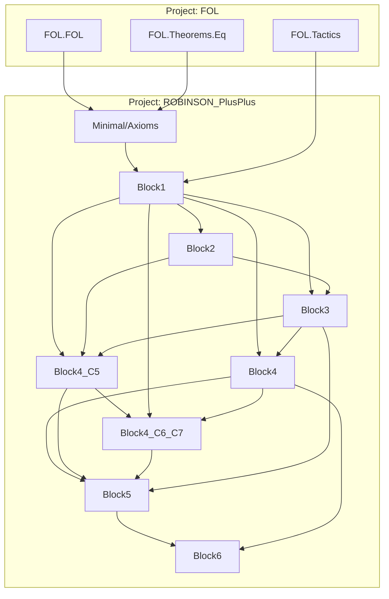

# Technical Reference — ROBINSON_PlusPlus

**Last updated:** 2026-07-14 — **`⊬¬G` (G INDECIDIBLE) sin postulados gödelianos (§41) · `axiomsCodeT` concretado, net‑0 axiomas (§42) · `hI_dot` COMPLETO (§38) · lógica interna (§39) · `pcc_bdAll_intro` (§40).** (§41, `Meta/OmegaReflect.lean`) **Gödel I COMPLETO** — `goedel_first_undecidable_real'` (`⊬G ∧ ⊬¬G`) con la reflexión como **hipótesis META explícita** (`Reflects`), reducida a **ω‑consistencia clásica + `NegVerifier`** (`reflects_of_omega`). Ni un postulado gödeliano. (§42, `Meta/AxiomListCode.lean` + `Minimal/Axioms.lean`) el sondeo de solidez halló que `axiomsCodeT` era **opaco** y bloqueaba `NegVerifier`; **concretado (opción 1)**: `ax_inAxC` → **`ax_axiomsCodeT_eq`** (ancla de igualdad, **net‑0 axiomas**, `ax_inAxC` ahora teorema), con la dirección negativa `neg_In_axiomsCodeT` **sin materializar** el término gigante. Build **95 jobs**, 0 sorrys. **Falta**: `NegVerifier` (plan `PLAN-NEGVERIFIER.md`) y D3 (`hC_dot`). — (previo 2026-07-13) **`hI_dot` COMPLETO (D3 ⇐ `hC_dot` solo) · LÓGICA INTERNA COMPLETA (§39) · `pcc_bdAll_intro` (§40) · AUDITORÍA `repasa_y_proyecta`.** (1) **`hI_dot`** cerrado (`Meta/D3InDotPrf.lean`): el átomo `In` punteado está reflejado, y **D3 queda reducida a UN SOLO lema** — `d3_prf_of_chainOkDot (φ) (hC)`. (2) **§39** (`Meta/PropCodePrf.lean`): las líneas‑axioma `p1`/`p2`/`j3`/`efq` **y la de INDUCCIÓN (`ind`, tag 18)** son TODAS **estructurales** ⇒ cuestan un testigo de una línea y salen libres de muro; con P1+P2+MP **`Prov` dispone ya de lógica completa** (MP, ∀‑elim, ∃‑intro, gen, Leibniz, ∧, ∨ intro **y elim**, ex‑falso, **inducción**). (3) **§40** (`Meta/BdAllIntroPrf.lean`): **`pcc_bdAll_intro`**, la INTRODUCCIÓN del `∀` acotado — keystone que §30 dejó pendiente y que bloqueaba `hC_dot`; se induce sobre la **cota** (no sobre el testigo) y hubo que **parametrizar sobre `p`** (el binder desplaza las libres). (4) ⚠️ **AUDITORÍA:** la mitad `⊬¬G` de Gödel I **NO está en la cadena real** (vivía en la capa legacy retirada en F7a) — ver [Incompletitud](doc/REFERENCE-Incompleteness.md) y `GODEL-STATUS.md`. Build **93 jobs**, 0 errores/warnings/sorrys (v4.31.0). **Falta para D3:** el cuerpo `lineOkB` de `hC_dot` (composite grande; el átomo `lineWF` es un subproyecto de 21 casos de tag). — (previo 2026-07-12) **REFERENCE RAMIFICADO en árbol (`doc/REFERENCE-*.md`, `AI-GUIDE.md` §0.5) + ruta B dotada (§3.20).** El índice raíz pasa a ser catálogo navegable (1565→~230 líneas); el detalle por módulo migró a cinco **nodos temáticos**: [Núcleo](doc/REFERENCE-Kernel.md), [Aritmética](doc/REFERENCE-Arithmetic.md), [Gödelización](doc/REFERENCE-Godelization.md), [Full](doc/REFERENCE-Full.md), [Incompletitud](doc/REFERENCE-Incompleteness.md). Trabajo D3 **ruta B**: `d3_prf_of_dotted_atoms` reduce D3 a las reflexiones punteadas `chainOk`/`In`; evaluación provable estructural completa (`pcc_eval_nthc`/`pcc_eval_carc_nthc`); sancionado `ax_lineWF_cons`; **`hI_dot` 4/5 ladrillos** (`substCodeT_closed`, `pcc_bdEx_intro_open`, `pcc_bddDot_imp_inDot`, `prf_bddCarcDot_eq_at`) — falta el núcleo de Step B (~80‑120 líneas). Build **91 jobs**, 0 errores/warnings/sorrys (v4.31.0). — (previo 2026-07-09c) **12‑A FASE 3 en curso: D3 reducida a la forma Δ₀ acotada + átomo `=eq`.** `Meta/Sigma1BoundedPrf.lean` (**`d3_prf_of_reflect_bounded`**: D3 reducida a reflejar `boundedIn`/`chainOkB` vía `pcc_imp` + los `⇔` de fase 1/2) y `Meta/Sigma1AtomPrf.lean` (toolkit RASTREADO del átomo `=eq`, espejo del de `In`). Hallazgo confirmado: la reflexión de `=eq` para términos abstractos es imposible libre de muro (Tarski) → se rastrea con `tcFn` y el puente se descarga en la inducción de fase 5 (numerales). Ver §3.19. Build **76 jobs**, 0 sorrys. — (previo 2026-07-09) **F7a COMPLETADA: 14 → 7 `axiom` de Lean.** Retirada la capa Gödel legacy postulada — módulo `Meta/Incompleteness.lean` **eliminado** (Gödel I/II vía D2/D3 postulados) + los 5 postulados legacy de `Meta/Provability.lean` (`Dem`, `dem_iff_provable`, `provFormula`, `provFormula_repr`, `diagonal_lemma`, `goedelSentence`, `goedelSentence_fixedpoint`). Auditado con `#print axioms`: la cadena real (`goedel_first_real'`, `d2_prf`, `goedel_second'`) no citaba ninguno. Nuevo registro autoritativo **`AXIOMS.md`**. Build **74 jobs**, 0 sorrys. F7b (retirar `d3`) sigue bloqueada hasta D3 real. — (previo 2026-07-08) **D3 / 12‑A: FASES 1a, 1b y 2 COMPLETAS — el verificador ya es Δ₀.** Cerrada la reformulación numérica del verificador, que era el único punto de diseño del plan 12‑A sin verificar en código (§13/§14 de `GODEL-D3-TRACKED-DESIGN.md`): **`prf_In_iff_boundedIn`** (`In x L ⇔ ∃i<lenc L. nthc L i =eq x`, `Meta/BoundedInPrf.lean`), **`prf_In_runFn_iff`** (`Meta/RunFnBoundedPrf.lean`) y **`prf_chainOk_iff_chainOkB`** (`Meta/ChainOkBoundedPrf.lean`) — en esta última **el acumulador desaparece**: `chainOk c p ⇔ ∀i<lenc p. (lineWF (nthc p i) ∧ ∀j<lenc (premsOf …). (In … c ∨ ∃k<i. carc (nthc p k) =eq …))`. Dos hallazgos abarataron la fase 2: (1) **no hace falta β‑función** — `runFn nil p` no es recursión con acumulador, es el *map* de `carc` sobre `p` (§13); (2) el acumulador de `chainOk` se elimina **generalizando en `c`** (`∀c` interno). Cimiento imprescindible: **toolkit aritmético de `<` en `Prf`** (`Meta/NatArithPrf.lean`) — `lt` se define por `∃k. a+σk=b` y `add` recurre por la derecha, así que `0+n=n` **no es teorema de Q** y hay que reconstruirlo con `Prf.ind`. Ver §3.18. Todos los teoremas nuevos `#print axioms` = `[propext, choice, Quot.sound]`. Build **75 jobs**, 0 errores, 0 warnings, 0 sorrys (v4.31.0). Siguiente: fases 3‑5 (`num` + evaluación provable + Δ₀‑completitud atómica → inducción estructural → `d3_prf` → `goedel_second_prf`). — (previo 2026-07-05d) **D3: `tcFn` DESCARTADO (§11–§12) → Σ₁‑completitud estándar (12‑A), fase 1a**. Investigación: no hay atajo para D3 (atajo por deducción imposible —D1 exige `Prf` cerrado—; `tcFn` stuck para testigo abstracto). Hallazgo: codificar el testigo ≡ representar el verificador sobre números Δ₀. Vía = **12‑A capa numérica Δ₀ del verificador**. **Fase 1a HECHA**: `lenc`/`nthc` (defs+4 axiomas en `Minimal/Axioms`, extensión conservadora, `axioms_eq` rfl, verificador/D1 intactos) + ecuaciones `Prf` (`Meta/NumListPrf.lean`) + `atom2CodeFn` (`Meta/TrackedCorePrf.lean`, infra). Ver §3.17 + `GODEL-D3-TRACKED-DESIGN.md` §11–§12. Build **71 jobs**, 0 sorrys (v4.31.0). — (previo 2026-07-05) **Opción A A‑F1/A‑F2/A‑F3** (`pcc_exIntro_code` + `prf_provCodeC'_of_tracked_witness`): `Meta/Sigma1CorePrf.lean`/`ExIntroCodePrf.lean`/`Sigma1TrackedPrf.lean`. — (previo 2026-07-04 20:15) **Migración a Lean v4.31.0 (última estable) + capa de código object para `In`** — (previo 2026-06-28 23:59) **Gödel II finitario en `Prf` — D1/D2 reales + D3 reducida + infraestructura de reflexión Σ₁** (ver §3.17). Cadena HBL sobre `Prf`: **D1** `repr_pos'_prf`, **teorema de deducción** `prf_deduction`/`prf_ex_elim_imp` + `∃` en `PrfH` (`PrfH_ex_intro/elim`), reglas `qconf`/`listInd`/`ind` en el verificador, los **10 lemas de cadena** (`ChainPrf`, paso 8, vía `norm32`/`norm_s`/confinación), **D2** `d2_prf` (`Meta/DerivCondPrf.lean`, `#print axioms` = `[propext, choice, Quot.sound]`), **D3 reducida** `d3_prf_of_sigma1` (`Meta/ReflectionPrf.lean`, reduce D3 a la Σ₁-completitud `hC`/`hI`), e **infraestructura de reflexión Σ₁** (`Meta/Sigma1Prf.lean`: `pcc_imp` + combinadores `In`/`chainOk`/`allIn` + transporte `prf_provCode_congr`). **~52 módulos**, 0 sorrys, **65 jobs**, toolchain `v4.29.1`. Pendiente Gödel II 100% real: el **núcleo duro de D3** (Σ₁-completitud provable del verificador, reformulada al nivel del código object `tcFn`/`substfc` — "la bestia", Fase 5) → `goedel_second_prf : ConsistentH → ¬ Prf Con'`. — (hito previo, 2026-06-24) **Gödel Nivel D REAL — D1 finitaria completa (`repr_pos'_prf`) + teorema de deducción finitario + regla `qconf` + fix de solidez FOL**. Re-nivelación de la cadena HBL a `Prf`: **`repr_pos'_prf : Prf φ → Prf (provCodeC' φ)`** (`Meta/ArithPrf.lean` porte finitario de toda la aritmetización; `Meta/Representability2Prf.lean` tracking; `Meta/ReprPrf.lean` primitivos+esquemas; `#print axioms` = estándar + `prf_inAxC`). **`Meta/HilbertDeduction.lean`**: cálculo con contexto `PrfH` + teorema de deducción (`prf_deduction`) + eliminación del ∃ (`prf_ex_elim_imp`), caso `gen` cerrado vía el esquema de **confinamiento ∀ `qconf`** (`confinementFormula`/`confinement_derives` en `Hilbert.lean`; `Prf.qconf`/`Rule.qconf` integrados en el verificador, doble aritmetización legacy+runFn). **Fix de solidez (FOL):** `subst_lift_cancel_formula` era un `axiom` general FALSO → ahora **teorema** restringido verdadero; toolkit De Bruijn nuevo en `FOL/Theorems/Eq.lean` (`substFormula_lift_comm`, `liftTerm_comm_zero`, `subst_subst_lift_gen`, `substTerm_lift_comm_zero`, `substTerm_subst_lift_gen`). **47 módulos**, 0 sorrys, **60 jobs**. Pendiente Gödel II 100% real: **lema de Barendregt** (subst–subst niveles mixtos) → inducción de listas en `Prf` → `d2_prf`/`d3_prf`/`goedel_second_prf : ConsistentH → ¬ Prf Con'`. — (hito previo) **Primer Teorema de Gödel REAL sin postulados**. Cadena completa sobre el cálculo de Hilbert finitario `Prf`: `Hilbert`/`HilbertSeq` (cálculo + verificador decidible + `dem_tracks`), `CodeArith`/`SubstArith`/`StepArith` (aritmética de códigos + sustitución/lift De Bruijn), `CheckArith` (verificador object `validProofFn` **19 reglas** + `provFormulaC` Σ₁), **`Representability`** (`repr_pos : Prf φ → axioms ⊢ provCodeC φ`), **`Necessitation`** (D1 + Gödel I modular), **`Diagonal`** (`tc_arith` código-del-código + `diag_arith` + **`godelC_fixedpoint : ⊢ G ⇔ ¬provCodeC G`** + **`goedel_first_real`**), **`CodeDistinct`** (aritmética negativa `formCode_ne`), **`Induction`** (`ind_concl_code` → regla `ind` integrada, IΣ₁). Soundness de `thy` vía `coreAxioms`/`formCodeM` (`provCodeC` fiel). **Regla `ind` integrada** (`Prf.ind`/`Rule.ind`/`ax_vpf_ind`/`vpf_ind`): `provCodeC` rastrea **IΣ₁**. Todo extensión definicional de `Minimal.axioms`; `#print axioms` de los resultados Gödel = ω-reglas ambiente + `Full.ax_induction` (axioma legítimo de aritmética), **ningún postulado de derivabilidad**. **Hacia D2/D3/Gödel II** — verificador estructural **`runFn`/`chainOk`** (`Meta/ProofChain.lean`, R1–R3) + **D1 y D2 reales sobre `provCodeC'`**: **D2** (`Meta/DerivCond.lean`, `d2`) y **D1 = `repr_pos'`** (`Meta/Representability2.lean`, `Prf φ → ⊢ provCodeC' φ`; `#print axioms` = solo estándar) con validez fiel de las 19 reglas (`lineWF`/`premsOf`). **Gödel II — núcleo lógico** (`Meta/GodelTwo.lean`): `con_imp_godel'`/`goedel_second'` vía **D2 real** + **D3 postulado** (`d3`) + hipótesis explícitas (punto fijo, necesitación, ⊬G ω); mejora sobre legacy (postulaba D2 y D3). **Refactor `Prf.thy → axioms`** ✅ (`axiomsCodeT` opaco + `ax_inAxC`). **Punto fijo real** ✅ `godelC'_fixedpoint` + **Gödel I real estructural** `goedel_first_real'` (`Meta/DiagonalTwo.lean`). **42 módulos** (Minimal 11 + Meta 20 + Full 11), 0 sorrys, **56 jobs**. Pendiente Gödel II 100% real: **re-nivelar la cadena HBL a `Prf`** (Gödel II = `¬ Prf Con'`; `provCodeC'` rastrea Prf, no ω) + **D3 real** (Σ₁-completitud provable). Plan: [GODEL-D-ARITHMETIZATION.md](GODEL-D-ARITHMETIZATION.md).
**Author**: Julián Calderón Almendros
**Lean version**: v4.31.0

---

## 0 · Naming Conventions Guide for the Reader

This project adopts [Mathlib](https://leanprover-community.github.io/contribute/naming.html)-style naming conventions. See `NAMING-CONVENTIONS.md` for the full reference and 12 formation rules.

### 0.1 Capitalization

- **Theorems/lemmas** (Prop): `snake_case` — `teo_2_7`, `mul_two_lt_mono`, `cantor_uniqueness`
- **Prop definitions** (predicates): `UpperCamelCase` — `IsFunction` (planned in Block7)
- **Functions/values**: `lowerCamelCase` — `pair`, `cantor_func`, `w_candidate`
- **Axioms**: `axNN_descriptor` or `ax_TagDescriptor` — `ax13_lt_def`, `ax_L0_cons_def`

### 0.2 Symbol-to-Word Dictionary

| Symbol | Name | | Symbol | Name | | Symbol | Name |
|--------|------|---|--------|------|---|--------|------|
| ∈ | `mem` / `In` | | + | `add` | | σ | `succ` |
| = | `eq` | | * | `mul` | | τ | `pred` |
| ≠ | `ne` | | − | `sub` | | √ | `sqrt` |
| ≤ | `le` | | / | `div` | | 0 | `zero` |
| < | `lt` | | ^ | `pow` | | 1 | `one` |
| ¬ | `not` / `neg` | | ∣ | `dvd` | | 2 | `two` |
| ⇔ | `iff` | | ↔ | `iff` | | ∅ | `empty` |
| ⇒ | `imp` (impl) | | ∨ | `lor` (or) | | ∧ | `land` (and) |

---

## 1 · Catálogo de módulos (índice raíz)

**El detalle exhaustivo (firmas Lean 4, dependencias por módulo, notación) vive en los nodos
temáticos `doc/REFERENCE-*.md`.** Esta tabla es el catálogo raíz; cada grupo enlaza a su nodo (árbol
REFERENCE, `AI-GUIDE.md` §0.5). **62 módulos fuente** (Minimal 11 + Meta 55 + Full 11) + barrels.

### 1.1 Núcleo → [`doc/REFERENCE-Kernel.md`](doc/REFERENCE-Kernel.md)

| Module | Namespace | Dependencies | Status |
|--------|-----------|--------------|--------|
| `Minimal/Axioms.lean` | `…Minimal.Axioms` | `FOL.FOL`, `FOL.Theorems.Eq` | ✅ Complete (Q++ + esquemas verificador + capa Δ₀ `lenc`/`nthc`/`ax_lineWF_inv`/`ax_lineWF_cons`) |

### 1.2 Aritmética desarrollada → [`doc/REFERENCE-Arithmetic.md`](doc/REFERENCE-Arithmetic.md)

| Module | Namespace | Dependencies | Status |
|--------|-----------|--------------|--------|
| `Minimal/Theorems/Block1.lean` | `…Block1` | `Axioms`, `FOL.Tactics` | ✅ Complete |
| `Minimal/Theorems/Block2.lean` | `…Block2` | `Axioms`, `Block1` | ✅ Complete |
| `Minimal/Theorems/Block3.lean` | `…Block3` | `Axioms`, `Block1`, `Block2` | ✅ Complete |
| `Minimal/Theorems/Block4.lean` | `…Block4` | `Axioms`, `Block1`, `Block3` | ✅ Complete |
| `Minimal/Theorems/Block4_C5.lean` | `…Block4_C5` | `Axioms`, `Block1`–`Block3` | ✅ Complete |
| `Minimal/Theorems/Block4_C6_C7.lean` | `…Block4_C6_C7` | `Axioms`, `Block1`–`Block4_C5` | ✅ Complete |
| `Minimal/Theorems/Block5.lean` | `…Block5` | `Axioms`, `Block1`–`Block4_C6_C7` | ✅ Complete |
| `Minimal/Theorems/Block6.lean` | `…Block6` | `Axioms`, `Block1`, `Block4`, `Block5` | ✅ Complete |
| `Minimal/Theorems/Block7.lean` | `…Block7` | `Axioms`, `Block1`, `Block4`, `Block4_C6_C7`, `Block5` | ✅ Complete |
| `Minimal/Theorems/Block8.lean` | `…Block8` | `Axioms`, `Block1`, `Block2`, `Block4_C5` | ✅ Complete (Fase 17 + Ax-P TFA) |

### 1.3 Gödelización Nivel B/C → [`doc/REFERENCE-Godelization.md`](doc/REFERENCE-Godelization.md)

| Module | Namespace | Dependencies | Status |
|--------|-----------|--------------|--------|
| `Meta/Godel.lean` | `…Meta.Godel` | `Axioms`, `Block6` | ✅ Nivel B: `G`, `⌜·⌝`, Teo G1 |
| `Meta/Provability.lean` | `…Meta.Provability` | `Axioms`, `Meta.Godel`, `FOL.*` | ✅ Nivel C: `formCode`, `IsFormula`, `Provable` (legacy retirada en F7a) |

### 1.4 Sistema `Full/` → [`doc/REFERENCE-Full.md`](doc/REFERENCE-Full.md)

| Module | Namespace | Dependencies | Status |
|--------|-----------|--------------|--------|
| `Full/Induction.lean` | `…Full` | `Axioms`, `FOL.*` | ✅ `ax_induction`/`inductionFormula` (+ ax6/7/10/11/12/18/19) |
| `Full/Mod2.lean` | `…Full` | `Axioms`, `Block1`, `Full.Induction` | ✅ ax21/ax24 |
| `Full/Lists.lean` | `…Full` | `Axioms`, `Full.Induction` | ✅ `ax_list_induction` (ax_C3/ax_L3) |
| `Full/StrongInduction.lean` | `…Full` | `Axioms`, `Full.Induction` | ✅ inducción fuerte derivada |
| `Full/Numerals.lean` | `…Full` | `Axioms`, `Block1`, `Full.Induction` | ✅ puente `numeral` + homomorfismo |
| `Full/Bounded.lean` | `…Full` | `Axioms`, `Full.{Induction,StrongInduction,Numerals}` | ✅ `le_numeral_split` |
| `Full/Divisibility.lean` | `…Full` | `Axioms`, `Block1`, `Block8`, `Full.*` | ✅ `numeral_dvd`, `divisor_le` |
| `Full/Division.lean` | `…Full` | `Axioms`, `Full.Numerals` | ✅ `division_numeral` |
| `Full/PrimeFactor.lean` | `…Full` | (ℕ pura) | ✅ Euclides + unicidad |
| `Full/Primality.lean` | `…Full` | `Axioms`, `Block1`, `Block8`, `Full.*` | ✅ `isPrime_numeral` |
| `Full/Factorization.lean` | `…Full` | `Axioms`, `Block8`, `Full.{Numerals,PrimeFactor}` | ✅ **`tfa_numeral`** (TFA completo) |

### 1.5 Incompletitud Nivel D → [`doc/REFERENCE-Incompleteness.md`](doc/REFERENCE-Incompleteness.md)

Cadena `Meta/` (orden del barrel `Meta.lean`). Detalle en el nodo §3.15–§3.20.

| Module | Rol · Estado |
|--------|--------------|
| `Meta/Hilbert.lean` | Nivel D F0: `Prf₀`/`Prf` + puentes (`dne` aislado) |
| `Meta/HilbertDeduction.lean` | Teorema de deducción finitario `PrfH` (`prf_deduction`/`prf_ex_elim_imp`) |
| `Meta/HilbertSeq.lean` | F1: `checkProof`, `prf_iff_derivation`, `Dem`, `dem_tracks` |
| `Meta/CodeArith.lean` · `SubstArith.lean` · `StepArith.lean` | F2.1–2.3: aritmética de códigos + sustitución/lift De Bruijn + reconocimiento de instancias |
| `Meta/CheckArith.lean` | F2.4: `validProofFn` (19 reglas) + `provFormulaC`/`provCodeC` Σ₁ |
| `Meta/Representability.lean` · `Necessitation.lean` · `Diagonal.lean` | F2.5–F3: `repr_pos`, D1/`necessitation`, `diag_arith` + **`goedel_first_real`** |
| `Meta/CodeDistinct.lean` · `Induction.lean` · `ListInductionArith.lean` | aritmética negativa `formCode_ne`; reglas `ind`/`listInd` (IΣ₁) |
| `Meta/ProofChain.lean` | verificador estructural `runFn`/`chainOk`/`lineOk`/`allIn` + `provCodeC'` |
| `Meta/DerivCond.lean` · `Representability2.lean` · `Reflection.lean` | **D2** `d2`, **D1** `repr_pos'`, combinadores `pcc_mp`/`pcc_exIntro` |
| `Meta/ReprPrf.lean` · `ArithPrf.lean` · `Representability2Prf.lean` · `ChainPrf.lean` | re-nivelación HBL a `Prf`: **D1** `repr_pos'_prf`, aritmetización finitaria, lemas de cadena |
| `Meta/DerivCondPrf.lean` · `ReflectionPrf.lean` | **D2** `d2_prf`; **D3 reducida** `d3_prf_of_sigma1` |
| `Meta/DiagonalTwo.lean` · `GodelTwo.lean` | **`goedel_first_real'`** (punto fijo `godelC'_fixedpoint`); Gödel II `goedel_second'` (módulo `axiom d3`) |
| `Meta/Sigma1Prf.lean` · `Sigma1CorePrf.lean` · `Sigma1TrackedPrf.lean` · `TrackedCorePrf.lean` · `TcArithPrf.lean` | reflexión Σ₁: `pcc_imp`, toolkit de `In`, testigo rastreado, `atom2CodeFn`, `tcFn` |
| `Meta/NumListPrf.lean` · `NatArithPrf.lean` · `BoundedInPrf.lean` · `RunFnBoundedPrf.lean` · `ChainOkBoundedPrf.lean` | 12‑A fases 1‑2: capa Δ₀ del verificador (`prf_In_iff_boundedIn`, `prf_In_runFn_iff`, `prf_chainOk_iff_chainOkB`) |
| `Meta/Sigma1BoundedPrf.lean` · `Sigma1AtomPrf.lean` | fase 3: `d3_prf_of_reflect_bounded`; átomo `=eq` rastreado (`pcc_eq_tracked`) |
| `Meta/SubstCodeOpenPrf.lean` · `ForallElimCodePrf.lean` · `ExIntroCodePrf.lean` · `MpCodePrf.lean` · `NumCodeClosedPrf.lean` | sistema de prueba interno a nivel de código (§19,25,26) + `substCodeT_closed` + `prf_liftc_tcFn` |
| `Meta/EvalArithPrf.lean` · `EvalListPrf.lean` · `EvalLtPrf.lean` · `EvalBoundedPrf.lean` · `EvalRunFnPrf.lean` · `EvalNthcPrf.lean` · `EvalCarcNthcPrf.lean` | evaluación provable: `+`, `carc`/`cdrc`/`lenc`, `<`, `∃i<B`/`∀i<B` (`bdExCode`), `nthc`, `carc∘nthc` |
| `Meta/Delta0ReflectPrf.lean` | reflexión Δ₀ atómica/composicional (`pcc_lt_tracked`, `pcc_reflect_and/or`, `pcc_gen_code`) |
| `Meta/D3DottedPrf.lean` · `LineWFConsPrf.lean` · `D3InDotPrf.lean` | **ruta B dotada**: `d3_prf_of_dotted_atoms`, `prf_line_is_cons`; **`hI_dot` COMPLETO** (`pcc_bdEx_intro_open`, `pcc_bddDot_imp_inDot_at`, `prf_bddCarcDot_eq_at`, `pcc_bddCarcDot_reflect`) ⇒ **`d3_prf_of_chainOkDot`: D3 ⇐ `hC_dot` SOLO** ✅ |
| `Meta/PropCodePrf.lean` | **§39 — lógica proposicional e INDUCCIÓN *internas* a nivel de código**: `pcc_p1_code`/`pcc_p2_code` (K,S), `pcc_j3_code` (`∨`‑elim), `pcc_efq_code`, **`pcc_ind_code`**; derivadas `pcc_weaken_code`, `pcc_imp_trans_code`, `pcc_or_elim_imp_code`. Todas **libres de muro** (líneas‑axioma estructurales, testigo de UNA línea) ✅ |
| `Meta/BdAllIntroPrf.lean` | **§40 — INTRODUCCIÓN del `∀` acotado** (keystone de `hC_dot`): **`pcc_bdAll_intro`** (parametrizado sobre `p`), `pcc_bdAll_base`, `pcc_bdAll_step`/`PrfH_bdAll_step`, `pcc_lt_succ_split_code`; auxiliares `prf_lt_succ_of_lt`, `prf_lt_succ_split'`, `pcc_eq_symm_code_internal`, `prf_congr_orc`, `prf_congr_substfc3` ✅ |
| `Meta/OmegaReflect.lean` | **§41 — `⊬¬G` (G INDECIDIBLE)**: `Reflects` (reflexión como hipótesis META explícita), `goedel_first_unrefutable_real'`, `goedel_first_undecidable_real'` (sin postulados gödelianos); reducción `OmegaConsistent` + `NegVerifier` ⟹ `Reflects` (`reflects_of_omega`, `goedel_first_undecidable_omega`) |
| `Meta/AxiomListCode.lean` | **§42 — `axiomsCodeT` concretado** (opción 1): `prf_not_In_listFormCodeM` (pertenencia negativa, recursión sin materializar), **`neg_In_axiomsCodeT`** (dirección negativa, desbloquea `NegVerifier`). Ancla `ax_axiomsCodeT_eq` (en `Minimal/Axioms`) reemplaza `ax_inAxC` (ahora teorema), net‑0 axiomas |

*Status codes*: ✅ Complete · 🧊 Frozen · 🔶 Partial · 🔄 In progress · ❌ Pending

> Build verde **95 jobs**, 0 errores, **0 warnings, 0 sorrys** (2026-07-14, Lean v4.31.0). **80 módulos
> fuente** (Minimal 11 + Meta 57 + Full 11), **918 símbolos exportados**. **7 `axiom` de Lean** (tras
> F7a): 3 esquemas de inducción (`Full/`), TFA (`Block8`), 2 anclas de codificación, y `d3` (único
> postulado gödeliano vivo, retirable con D3 real). Inventario en **`AXIOMS.md`**. Ninguna es un
> `sorry` (ADR-008).
>
> ⚠️ **Auditoría 2026-07-13 (`repasa_y_proyecta`):** la mitad **`⊬¬G`** de Gödel I (indecidibilidad)
> **NO está en la cadena real** — se probó en la capa legacy (`Meta/Incompleteness.lean`, con D2/D3
> postulados) y se retiró en **F7a**. Hoy la cadena real da **sólo `⊬G`** (`goedel_first_real'`).
> Re‑derivarla es **tarea abierta, independiente de D3**. Ver [Incompletitud](doc/REFERENCE-Incompleteness.md).

---

## 2 · Dependency Graph

---

## 3 · Descripción de módulos — mapa de nodos temáticos

El detalle por módulo (definiciones, axiomas, firmas Lean 4, notación, dependencias) **ya no vive en
este índice raíz**, sino en los cinco **nodos temáticos** (`doc/REFERENCE-*.md`). Regla del árbol
REFERENCE (`AI-GUIDE.md` §0.5): el índice raíz cataloga y navega; los nodos documentan.

| Nodo | Cubre | Secciones |
|------|-------|-----------|
| [**Núcleo**](doc/REFERENCE-Kernel.md) | `Minimal/Axioms` — teoría objeto FOL⁼ (Q++), esquemas del verificador, capa Δ₀ | §3.1 |
| [**Aritmética**](doc/REFERENCE-Arithmetic.md) | `Block1–8` — aritmética desarrollada, Cantor, pares, listas, primos/TFA objeto | §3.2–§3.11 |
| [**Gödelización**](doc/REFERENCE-Godelization.md) | `Meta/Godel`, `Meta/Provability` — Nivel B/C (`⌜·⌝`, `formCode`, `Provable`) | §3.12–§3.13 |
| [**Full**](doc/REFERENCE-Full.md) | `Full/` — inducción general, representabilidad, `numeral`, TFA | §3.14 |
| [**Incompletitud**](doc/REFERENCE-Incompleteness.md) | Nivel D: Gödel I/II, D1–D3, Σ₁‑completitud provable (12‑A), ruta B dotada | §3.15–§3.20 |

**Navegación fuerte:** cada nodo enlaza de vuelta a este índice, a sus nodos hermanos relacionados y a
los ficheros `.lean` que documenta. El subsistema **activo** es [Incompletitud](doc/REFERENCE-Incompleteness.md)
(§3.20 = estado vivo de la ruta B: `hI_dot` 4/5 ladrillos).

---

## 4 · Patterns notables y deuda técnica

- **Patrón `spec + simp`**: cada axioma instanciado vía `spec h_axN t` requiere un `simp` con simp-set propio según los binders del axioma. Para axiomas `forall_2` se necesita `liftTerm`/`FOL.substTerm_liftTerm`; para `forall_3`, además `FOL.substTerm_liftLift`. Ver `THOUGHTS.md` y `feedback_build_cache` en memoria de Claude.
- **`Γ` por módulo**: cada módulo define `def Γ := axioms`. La unificación entre `Block2.Γ` y `Block4_C5.Γ` falla con `apply` pero pasa con `exact` (defeq).
- **`=eq` no-estándar `eq_trans`**: `eq_trans (h1:a=b)(h2:a=c):b=c`. Para `a=b, b=c → a=c` usar `FOL.derive_eq_trans`.
- **Linter `unusedSimpArgs` desactivado** en todos los módulos (2026-06-06): `set_option linter.unusedSimpArgs false` global. Previamente se hizo un barrido a `true` (411 → 0 warnings), que confirmó qué args de `simp` eran innecesarios; tras ello se decidió dejar el linter en `false` (puede dar falsos positivos bajo binders existenciales y se prefiere libertad para conservar args de `simp` por robustez). El build permanece con 0 warnings.

---

## 5 · Próximos pasos

Ver `NEXT-STEPS.md` (punto de reanudación), `GODEL-D3-TRACKED-DESIGN.md` (plan 12‑A) y
`ESCALANDO_EL_PROYECTO.md` (enlace con el proyecto hermano DeepArith sobre el kernel FOL⁼ común).

**Estado 2026-07-13 (auditado con `repasa_y_proyecta`).** Build **93 jobs**, 0 sorrys, 7 `axiom` de Lean.

1. **Gödel I — sólo `⊬G`** (`goedel_first_real'`, `Meta/DiagonalTwo.lean`), real y sin postulados, vía
   ω‑consistencia.
   ⚠️ **La mitad `⊬¬G` (indecidibilidad) NO está en la cadena real.** Se probó el 2026-06-13
   (`goedel_first_unrefutable`/`goedel_first_undecidable`, vía `dne` clásica) pero **en la capa LEGACY**
   (`Meta/Incompleteness.lean`, que postulaba D2/D3), y esa capa se **retiró en F7a** (`f03eacf`). Esos
   teoremas **ya no existen**. **Tarea abierta** (independiente de D3): re‑derivarlos sobre la cadena
   real — el punto fijo real ya existe (`godelC'_fixedpoint`) y D1/D2 son reales, así que el porte del
   argumento `dne` parece barato.
2. **D1** ✅ (`repr_pos'_prf`) y **D2** ✅ (`d2_prf`, `[propext, choice, Quot.sound]`).
3. **D3 — reducida a UN SOLO lema.** `d3_prf_of_chainOkDot (φ) (hC)` (§3.20.5): con `hI_dot` ✅ cerrado,
   D3 depende únicamente de **`hC_dot`** (la reflexión punteada de `chainOk`). Los dos keystones que la
   bloqueaban están hechos: **lógica interna completa** (§3.20.6, incl. `pcc_ind_code`) e
   **introducción del `∀` acotado** (§3.20.7, `pcc_bdAll_intro`).
   ⏳ **Falta el cuerpo `lineOkB`** (§3.20.8): composite grande — toda la maquinaria existe, pero el
   átomo **`lineWF` es un subproyecto** (21 casos de tag). Estimación honesta: 2‑4 sesiones.
4. **F7b** (retirar `axiom d3`, 7→6) sigue **bloqueada** hasta D3 real. `d3` es el único postulado
   gödeliano vivo.
5. **Alternativa siempre disponible:** consolidar Gödel II **módulo el axioma D3** (`goedel_second'`).
   Estado ya publicable (Gödel I `⊬G` real + D1/D2 reales); D3 es notoriamente la pieza más dura de
   Gödel II también en Isabelle/Coq.

**Resumen histórico** (estado 2026-06-12 — ⚠️ **la capa Gödel LEGACY que describe el punto 3 fue
ELIMINADA en F7a**, 2026-07-09; se conserva como registro):

1. **`Minimal/` ✅ cerrado**: Bloques I–VIII + extensión TFA. ax22/ax23/ax27/ax28 eliminados.
2. **`Full/` ✅**: inducción general object-level + capa de representabilidad. Fragmento de Minimal derivado como teoremas: ax6/7/10–12, ax18/19, ax21/24, ax_C3/L3. **TFA completo** (`tfa_numeral`: existencia object ∧ unicidad ℕ), autocontenido sin Mathlib/Peano. `Intermediate/` eliminado (caso particular de Full).
3. ~~**`Meta/` (Niveles A–D)**: **D** (`Meta/Incompleteness.lean`): Gödel I mitad esencial (`goedel_first_unprovable`, `goedel_first_true`) + Gödel II (`goedel_second`, postulando D2/D3).~~ — **capa retirada en F7a**; sustituida por la cadena real (`goedel_first_real'` / `goedel_second'`).
4. **Refactor**: 5 meta-reglas ω de deducción movidas a `FOL/MetaRules.lean` (re-export desde `Minimal.Axioms`, cero churn).
5. **Pendiente**: proyecto hermano `FOL_CompStructs` (listas/tuplas como base de Peano/AczelSetTheory); CZF / análisis constructivo (muy largo plazo).

---

**Author**: Julián Calderón Almendros
