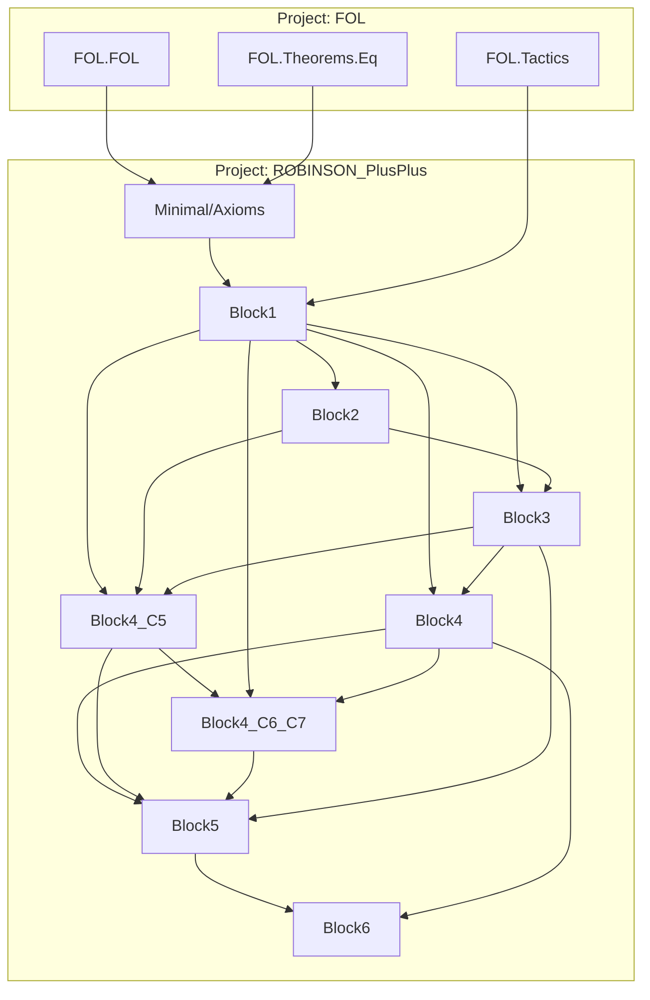

# Technical Reference — ROBINSON_PlusPlus

> ## ESTADO REAL — 2026-08-23 · repatriación en curso
>
> **Build 104 jobs · 0 errores · 0 warnings · 0 sorrys · Lean v4.31.0.**
> **90 módulos activos** (Minimal 11 + Meta 68 + Full 11) **+ 14 en `cuarentena/`** (fuera del build)
> **+ 10 en `sondeos/`** (experimentos compilados, fuera del build).
> **7 `axiom` de Lean** ([`AXIOMS.md`](AXIOMS.md)) · **141 axiomas objeto** en `axioms`.
>
> ### ✅ La inconsistencia conocida está REPARADA ([ADR‑012](DECISIONS.md))
>
> `ax_tc_cons` **retirado** de `axioms`: obligaba a `tcFn` a recurrir a la vez sobre estructura
> NUMERAL y sobre estructura de CÓDIGO — imposible, porque en ℕ el mismo valor es ambas cosas
> (`cons 0 nil = 2 = σσ0`). Los códigos de Gödel se escriben ahora como **NUMERALES**.
>
> * **`goedel_first_real'`, `godelC'_fixedpoint` y `goedel_first_undecidable_real'` YA NO EXISTEN.**
>   Gödel I es hoy **`goedel_first_numeral`** (`Meta/DiagonalNumeral.lean`), sobre `godelCN`.
> * **21 módulos en `cuarentena/`** ([ADR‑013](DECISIONS.md)): sus teoremas eran formalmente
>   correctos pero **vacuos**. NO borrados.
> * ⚠️ **NO es una prueba de consistencia**: se retiró la inconsistencia **conocida y localizada**.
>
> ### ✅ La ESCALERA (a.2) está COMPLETA — 4 de 4
>
> `pcc_eval_add` → `pcc_eval_mul` → `div2` → **`pcc_dot_cons`** (`Meta/DotConsPrf.lean`): la
> Σ₁‑completitud **internalizada** para argumentos abstractos, que es lo que repatría la cuarentena.
> Rédito verificado en `sondeos/CarcPayoff.lean` (`pcc_eval_carc` vuelve). Detalle en
> [Incompletitud §3.24–§3.25](doc/REFERENCE-Incompleteness.md).
>
> **Punto de reanudación:** **[NEXT-STEPS.md](NEXT-STEPS.md)** → **[PLAN-FRENTE-A.md](PLAN-FRENTE-A.md)**
> → [cuarentena/README.md](cuarentena/README.md) → [sondeos/README.md](sondeos/README.md).

**Last updated:** 2026-08-22 23:55 · HEAD `68fa43c` · Lean v4.31.0

> **El historial detallado vive en [`CHANGELOG.md`](CHANGELOG.md)**, no aquí. Este índice describe
> el **estado actual**; la línea de "Last updated" dejó de ser un volcado acumulativo el
> 2026-08-22 (había crecido a ~20 KB en una sola línea, ilegible y sistemáticamente desfasada).

**Author**: Julián Calderón Almendros
**Lean version**: v4.31.0

---

## 0 · Naming Conventions Guide for the Reader

This project adopts [Mathlib](https://leanprover-community.github.io/contribute/naming.html)-style naming conventions. See `NAMING-CONVENTIONS.md` for the full reference and 12 formation rules.

### 0.1 Capitalization

- **Theorems/lemmas** (Prop): `snake_case` — `teo_2_7`, `mul_two_lt_mono`, `cantor_uniqueness`
- **Prop definitions** (predicates): `UpperCamelCase` — `IsFunction` (planned in Block7)
- **Functions/values**: `lowerCamelCase` — `pair`, `cantor_func`, `w_candidate`
- **Axioms**: `axNN_descriptor` or `ax_TagDescriptor` — `ax13_lt_def`, `ax_L0_cons_def`

### 0.2 Symbol-to-Word Dictionary

| Symbol | Name | | Symbol | Name | | Symbol | Name |
|--------|------|---|--------|------|---|--------|------|
| ∈ | `mem` / `In` | | + | `add` | | σ | `succ` |
| = | `eq` | | * | `mul` | | τ | `pred` |
| ≠ | `ne` | | − | `sub` | | √ | `sqrt` |
| ≤ | `le` | | / | `div` | | 0 | `zero` |
| < | `lt` | | ^ | `pow` | | 1 | `one` |
| ¬ | `not` / `neg` | | ∣ | `dvd` | | 2 | `two` |
| ⇔ | `iff` | | ↔ | `iff` | | ∅ | `empty` |
| ⇒ | `imp` (impl) | | ∨ | `lor` (or) | | ∧ | `land` (and) |

---

## 1 · Catálogo de módulos (índice raíz)

**El detalle exhaustivo (firmas Lean 4, dependencias por módulo, notación) vive en los nodos
temáticos `doc/REFERENCE-*.md`.** Esta tabla es el catálogo raíz; cada grupo enlaza a su nodo (árbol
REFERENCE, `AI-GUIDE.md` §0.5).

**90 módulos activos** (Minimal 11 + Meta 68 + Full 11) + barrel `Meta.lean` + raíz
`ROBINSON_PlusPlus.lean`. Fuera del build: **14 en `cuarentena/`** (§1.6) y **10 en `sondeos/`**
(experimentos compilados a mano; catálogo en [`sondeos/README.md`](sondeos/README.md)).

### 1.1 Núcleo → [`doc/REFERENCE-Kernel.md`](doc/REFERENCE-Kernel.md)

| Module | Namespace | Dependencies | Status |
|--------|-----------|--------------|--------|
| `Minimal/Axioms.lean` | `…Minimal.Axioms` | `FOL.FOL`, `FOL.Theorems.Eq` | ✅ Complete (Q++ + esquemas verificador + capa Δ₀ `lenc`/`nthc`/`ax_lineWF_inv`/`ax_lineWF_cons`) |

### 1.2 Aritmética desarrollada → [`doc/REFERENCE-Arithmetic.md`](doc/REFERENCE-Arithmetic.md)

| Module | Namespace | Dependencies | Status |
|--------|-----------|--------------|--------|
| `Minimal/Theorems/Block1.lean` | `…Block1` | `Axioms`, `FOL.Tactics` | ✅ Complete |
| `Minimal/Theorems/Block2.lean` | `…Block2` | `Axioms`, `Block1` | ✅ Complete |
| `Minimal/Theorems/Block3.lean` | `…Block3` | `Axioms`, `Block1`, `Block2` | ✅ Complete |
| `Minimal/Theorems/Block4.lean` | `…Block4` | `Axioms`, `Block1`, `Block3` | ✅ Complete |
| `Minimal/Theorems/Block4_C5.lean` | `…Block4_C5` | `Axioms`, `Block1`–`Block3` | ✅ Complete |
| `Minimal/Theorems/Block4_C6_C7.lean` | `…Block4_C6_C7` | `Axioms`, `Block1`–`Block4_C5` | ✅ Complete |
| `Minimal/Theorems/Block5.lean` | `…Block5` | `Axioms`, `Block1`–`Block4_C6_C7` | ✅ Complete |
| `Minimal/Theorems/Block6.lean` | `…Block6` | `Axioms`, `Block1`, `Block4`, `Block5` | ✅ Complete |
| `Minimal/Theorems/Block7.lean` | `…Block7` | `Axioms`, `Block1`, `Block4`, `Block4_C6_C7`, `Block5` | ✅ Complete |
| `Minimal/Theorems/Block8.lean` | `…Block8` | `Axioms`, `Block1`, `Block2`, `Block4_C5` | ✅ Complete (Fase 17 + Ax-P TFA) |

### 1.3 Gödelización Nivel B/C → [`doc/REFERENCE-Godelization.md`](doc/REFERENCE-Godelization.md)

| Module | Namespace | Dependencies | Status |
|--------|-----------|--------------|--------|
| `Meta/Godel.lean` | `…Meta.Godel` | `Axioms`, `Block6` | ✅ Nivel B: `G`, `⌜·⌝`, Teo G1 |
| `Meta/Provability.lean` | `…Meta.Provability` | `Axioms`, `Meta.Godel`, `FOL.*` | ✅ Nivel C: `formCode`, `IsFormula`, `Provable` (legacy retirada en F7a) |

### 1.4 Sistema `Full/` → [`doc/REFERENCE-Full.md`](doc/REFERENCE-Full.md)

| Module | Namespace | Dependencies | Status |
|--------|-----------|--------------|--------|
| `Full/Induction.lean` | `…Full` | `Axioms`, `FOL.*` | ✅ `ax_induction`/`inductionFormula` (+ ax6/7/10/11/12/18/19) |
| `Full/Mod2.lean` | `…Full` | `Axioms`, `Block1`, `Full.Induction` | ✅ ax21/ax24 |
| `Full/Lists.lean` | `…Full` | `Axioms`, `Full.Induction` | ✅ `ax_list_induction` (ax_C3/ax_L3) |
| `Full/StrongInduction.lean` | `…Full` | `Axioms`, `Full.Induction` | ✅ inducción fuerte derivada |
| `Full/Numerals.lean` | `…Full` | `Axioms`, `Block1`, `Full.Induction` | ✅ puente `numeral` + homomorfismo |
| `Full/Bounded.lean` | `…Full` | `Axioms`, `Full.{Induction,StrongInduction,Numerals}` | ✅ `le_numeral_split` |
| `Full/Divisibility.lean` | `…Full` | `Axioms`, `Block1`, `Block8`, `Full.*` | ✅ `numeral_dvd`, `divisor_le` |
| `Full/Division.lean` | `…Full` | `Axioms`, `Full.Numerals` | ✅ `division_numeral` |
| `Full/PrimeFactor.lean` | `…Full` | (ℕ pura) | ✅ Euclides + unicidad |
| `Full/Primality.lean` | `…Full` | `Axioms`, `Block1`, `Block8`, `Full.*` | ✅ `isPrime_numeral` |
| `Full/Factorization.lean` | `…Full` | `Axioms`, `Block8`, `Full.{Numerals,PrimeFactor}` | ✅ **`tfa_numeral`** (TFA completo) |

### 1.5 Incompletitud Nivel D → [`doc/REFERENCE-Incompleteness.md`](doc/REFERENCE-Incompleteness.md)

Los **68 módulos activos** de `Meta/`, en el orden del barrel
[`Meta.lean`](ROBINSON_PlusPlus/Meta.lean). Detalle en el nodo §3.15–§3.25.

| # | Module | Rol · Estado |
|--:|--------|--------------|
| 1–2 | `Godel.lean` · `Provability.lean` | Nivel B/C — ver §1.3 |
| 3–5 | `Hilbert.lean` · `HilbertDeduction.lean` · `HilbertSeq.lean` | F0/F1: `Prf₀`/`Prf` + puentes (`dne` aislado); deducción finitaria `PrfH` (`prf_deduction`/`prf_ex_elim_imp`); `checkProof`, `Dem`, `dem_tracks` |
| 6–9 | `CodeArith.lean` · `SubstArith.lean` · `StepArith.lean` · `CheckArith.lean` | F2.1–2.4: aritmética de códigos, sustitución/lift De Bruijn, reconocimiento de instancias, `validProofFn` (19 reglas) + `provFormulaC`/`provCodeC` Σ₁ |
| 10–12 | `Representability.lean` · `Necessitation.lean` · `Diagonal.lean` | F2.5–F3: `repr_pos`, D1/`necessitation`, `diag_arith`, `tc_numeral` |
| 13–15 | `CodeDistinct.lean` · `Induction.lean` · `ListInductionArith.lean` | aritmética negativa `formCode_ne`; reglas `ind`/`listInd` (IΣ₁) |
| 16 | `ProofChain.lean` | verificador estructural `runFn`/`chainOk`/`lineOk`/`allIn` + `provCodeC'` |
| 17–19 | `DerivCond.lean` · `Representability2.lean` · `Reflection.lean` | **D2** `d2`, **D1** `repr_pos'`, combinadores `pcc_mp`/`pcc_exIntro` (capa ω) |
| 20–26 | `ReprPrf.lean` · `LineWFDerives.lean` · `ArithPrf.lean` · `Representability2Prf.lean` · `ChainPrf.lean` · `DerivCondPrf.lean` · `ReflectionPrf.lean` | re‑nivelación HBL a `Prf`: **D1** `repr_pos'_prf` ✅, aritmetización finitaria, 10 lemas de cadena, **D2** `d2_prf` ✅, **D3 reducida** `d3_prf_of_sigma1` |
| 27–29 | `Sigma1Prf.lean` · `TcArithPrf.lean` · `NumListPrf.lean` | reflexión Σ₁ (`pcc_imp`, toolkit de `In`); `tcFn` (`prf_tc_zero`/`prf_tc_succ`/**`prf_tc_numeral`**); `lenc`/`nthc` |
| 30–34 | `NatArithPrf.lean` · `NatOrderPrf.lean` · `NatMulPrf.lean` · `CantorMonoPrf.lean` · `Div2ParityPrf.lean` | **aritmética en `Prf`**: `<` y `prf_nat_induction`; orden `≤`; producto, tricotomía, cancelación; **`prf_cantor_mono_left/right`**; **`prf_div2_numeral`** y **`prf_cons_double`**. Ver §3.24.3–§3.24.4 |
| 35–36 | **`CodeNumeralPrf.lean`** · **`DiagonalNumeral.lean`** | **LA REPARACIÓN (ADR‑012)**: `consN` por números triangulares (sin división), `codeNat`, **`prf_formCode_numeral`**; lema diagonal numeral, `godelCN_fixedpoint`, **`goedel_first_numeral`** (Gödel I). Ver §3.24.2/§3.24.5 |
| 37 | `Sigma1CorePrf.lean` | **keystone de (a.1)**, refundado a códigos estáticos numerales — devolvió 10 módulos de la cuarentena. ⚠️ 3 enunciados cambiaron (§3.24.7) |
| 38–39 | **`EvalArithPrf.lean`** · **`EvalMulPrf.lean`** | **escalera (a.2) peldaños 1–2**: `pcc_eval_add`, `pcc_eval_mul`; y el toolkit ecuacional interno (`pcc_leibniz_apply`, `pcc_eq_trans_code`, `substtc_inv_*`). Ver §3.25.1–§3.25.2 |
| 40–47 | `ExIntroCodePrf.lean` · `ForallElimCodePrf.lean` · `LineWFCases.lean` · `MpCodePrf.lean` · `OmegaReflect.lean` · `Sigma1AtomPrf.lean` · `Sigma1TrackedPrf.lean` · `TrackedCorePrf.lean` | sistema de prueba interno a nivel de código (`pcc_axiom_inst`, **`pcc_thm_inst`**); los 21 tags (`tagArity`/`tagConcl`/`tagPrems` + dirección negativa); `Reflects` y `reflects_of_omega`; átomo `=eq` rastreado (`eqCodeFn`); testigo rastreado; `atom2CodeFn` |
| 48 | `StrongInductionPrf.lean` | inducción fuerte en `Prf` (`prf_strong_induction`, `prf_le_of_lt_succ`). Ver §3.24.6 |
| 49–52 | `BoundedInPrf.lean` · `RunFnBoundedPrf.lean` · `ChainOkBoundedPrf.lean` · `Sigma1BoundedPrf.lean` | 12‑A fases 1‑3: capa Δ₀ del verificador (`prf_In_iff_boundedIn`, `prf_In_runFn_iff`, `prf_chainOk_iff_chainOkB`) + `d3_prf_of_reflect_bounded` |
| 53–54 | `SubstCodeOpenPrf.lean` · `NumCodeClosedPrf.lean` | `prf_substfc_arith_open`, `substCodeT_closed`; `prf_liftc_tcFn`, `prf_substtc_tcFn` |
| 55 | **`DotConsPrf.lean`** | **escalera (a.2) peldaño 4 — `pcc_dot_cons`** ✅, más las herramientas `pcc_rw`/`pcc_rw_div2`. Ver §3.25.3 |
| 56–57 | `LineWFConsPrf.lean` · `AxiomListCode.lean` | `prf_line_is_cons`; `axiomsCodeT` concretado (§42): `prf_not_In_listFormCodeM`, `neg_In_axiomsCodeT` |
| 58–59 | `CodeDecode.lean` · `ChainDecode.lean` | **módulo A de `NegVerifier`** (§43): `decodeForm` biyección verificada + `decodeChain_prf` (cadena aceptada ⟹ `Prf`) |
| 60–61 | `DiagonalTwo.lean` · `GodelTwo.lean` | infraestructura del punto fijo (`goedel_first_unprovable_real'`); **Gödel II `goedel_second'`**, módulo `axiom d3` |

*Status codes*: ✅ Complete · 🧊 Frozen · 🔶 Partial · 🔄 In progress · ❌ Pending

### 1.6 `cuarentena/` — 14 módulos FUERA del build

> ⚠️ **No son código vigente.** Sus teoremas son **formalmente correctos** pero se demostraron sobre
> una teoría que probaba ⊥ — o sea, **vacuos** ([ADR‑013](DECISIONS.md)). No se borran: la
> recuperación es **estructurada**, no un rescate ciego. Catálogo y grafo en
> [`cuarentena/README.md`](cuarentena/README.md).

**8 raíces** (lo que hay que refundar): `CodeCtorKit`, `D3InDotPrf`, `EvalListPrf`, `EvalNthcPrf`,
`InAxiomsCodePrf`, `LineWFTrackedPrf`. **`EvalListPrf` es el keystone** — es la BASE: los otros 20 dependen de él.

**13 no‑raíz**: `BdAllIntroPrf`, `CodeTreeReflect`, `D3DottedPrf`, `Delta0ReflectPrf`,
`EvalBoundedPrf`, `EvalCarcNthcPrf`, `EvalLtPrf`, `EvalRunFnPrf`, `LineWFAssemblePrf`,
`LineWFEfqPrf`, `LineWFMpPrf`, `LineWFPropPrf`, `LineWFSchemaPrf`, `LineWFThyPrf`, `PropCodePrf`.

Con ellos salen de la cadena activa **D3** y **Gödel II** (`goedel_second'` sigue compilando, pero
cita `axiom d3`).

> **7 `axiom` de Lean** (tras F7a): 3 esquemas de inducción (`Full/Induction`, `Full/Lists`,
> `Full/Mod2`), TFA (`Block8.ax_p_tfa`), 2 anclas de codificación (`ax_axiomsCodeT_eq` en `⊢` y
> `prf_axiomsCodeT_eq` en `Prf`), y `d3` (único postulado gödeliano vivo, retirable con D3 real).
> Inventario en **[`AXIOMS.md`](AXIOMS.md)**. Ninguna es un `sorry` (ADR‑010).
>
> ⚠️ **La mitad `⊬¬G` de Gödel I (indecidibilidad) sigue SIN cerrar en la cadena real.** Se probó en
> la capa legacy (`Meta/Incompleteness.lean`, con D2/D3 postulados **y** el postulado falso
> `provFormula_repr`) y se retiró en **F7a** — *no revertir, fue un arreglo de solidez*.
> `goedel_first_undecidable_numeral` la da **tomando `Reflects` como hipótesis META explícita**; para
> descargarla falta **`NegVerifier`** (`PLAN-NEGVERIFIER.md`). Tarea abierta e **independiente de D3**.

---

## 2 · Dependency Graph

---

## 3 · Descripción de módulos — mapa de nodos temáticos

El detalle por módulo (definiciones, axiomas, firmas Lean 4, notación, dependencias) **ya no vive en
este índice raíz**, sino en los cinco **nodos temáticos** (`doc/REFERENCE-*.md`). Regla del árbol
REFERENCE (`AI-GUIDE.md` §0.5): el índice raíz cataloga y navega; los nodos documentan.

| Nodo | Cubre | Secciones |
|------|-------|-----------|
| [**Núcleo**](doc/REFERENCE-Kernel.md) | `Minimal/Axioms` — teoría objeto FOL⁼ (Q++), esquemas del verificador, capa Δ₀ | §3.1 |
| [**Aritmética**](doc/REFERENCE-Arithmetic.md) | `Block1–8` — aritmética desarrollada, Cantor, pares, listas, primos/TFA objeto | §3.2–§3.11 |
| [**Gödelización**](doc/REFERENCE-Godelization.md) | `Meta/Godel`, `Meta/Provability` — Nivel B/C (`⌜·⌝`, `formCode`, `Provable`) | §3.12–§3.13 |
| [**Full**](doc/REFERENCE-Full.md) | `Full/` — inducción general, representabilidad, `numeral`, TFA | §3.14 |
| [**Incompletitud**](doc/REFERENCE-Incompleteness.md) | Nivel D: Gödel I/II, D1–D3, Σ₁‑completitud provable (12‑A), módulos A/B de `NegVerifier`, **la REPARACIÓN (§3.24) y la ESCALERA (§3.25)** | §3.15–§3.25 |

**Navegación fuerte:** cada nodo enlaza de vuelta a este índice, a sus nodos hermanos relacionados y a
los ficheros `.lean` que documenta. El subsistema **activo** es
[Incompletitud](doc/REFERENCE-Incompleteness.md) — su **estado vivo** es **§3.25** (la escalera, ✅
completa) y lo siguiente es repatriar `cuarentena/` (§1.6).

⚠️ **§3.15–§3.23 son ANTERIORES a la reparación** (ADR‑012/013). Lo que dicen de la capa rastreada
describe fielmente el código de `cuarentena/`, pero **ese código no está en el build** y sus
enunciados cambiarán al repatriarse. §3.15 documenta un **módulo eliminado** (`Meta/Incompleteness.lean`,
borrado en F7a) y está marcado como tal.

---

## 4 · Patterns notables y deuda técnica

- **Patrón `spec + simp`**: cada axioma instanciado vía `spec h_axN t` requiere un `simp` con simp-set propio según los binders del axioma. Para axiomas `forall_2` se necesita `liftTerm`/`FOL.substTerm_liftTerm`; para `forall_3`, además `FOL.substTerm_liftLift`. Ver `THOUGHTS.md` y `feedback_build_cache` en memoria de Claude.
- **`Γ` por módulo**: cada módulo define `def Γ := axioms`. La unificación entre `Block2.Γ` y `Block4_C5.Γ` falla con `apply` pero pasa con `exact` (defeq).
- **`=eq` no-estándar `eq_trans`**: `eq_trans (h1:a=b)(h2:a=c):b=c`. Para `a=b, b=c → a=c` usar `FOL.derive_eq_trans`.
- **Linter `unusedSimpArgs` desactivado** en todos los módulos (2026-06-06): `set_option linter.unusedSimpArgs false` global. Previamente se hizo un barrido a `true` (411 → 0 warnings), que confirmó qué args de `simp` eran innecesarios; tras ello se decidió dejar el linter en `false` (puede dar falsos positivos bajo binders existenciales y se prefiere libertad para conservar args de `simp` por robustez). El build permanece con 0 warnings.

---

## 5 · Próximos pasos

Punto de reanudación: **[NEXT-STEPS.md](NEXT-STEPS.md)** → **[PLAN-FRENTE-A.md](PLAN-FRENTE-A.md)**.
Visión a largo plazo: [PLANNING.md](PLANNING.md). Libro: [PLAN-LIBRO.md](PLAN-LIBRO.md).

**Estado 2026-08-23.** Build **104 jobs**, **90 módulos activos**, 0 sorrys, 7 `axiom` de Lean.

### Lo que está cerrado

1. **Gödel I — `⊬G`**: `goedel_first_numeral (hcon : ConsistentOmega) : ¬ Prf godelCN`
   (`Meta/DiagonalNumeral.lean`), sobre el punto fijo real `godelCN_fixedpoint`. Footprint = la base
   sancionada **menos `tc_cons`**.
2. **D1** ✅ `repr_pos'_prf` y **D2** ✅ `d2_prf` — reales, sobre el cálculo finitario `Prf`.
3. **La ESCALERA (a.2)** ✅ **4 de 4** (§3.25): `pcc_eval_add`, `pcc_eval_mul`, el atajo de `div2`, y
   **`pcc_dot_cons`**. Es la Σ₁‑completitud internalizada para argumentos abstractos.

### Los tres frentes abiertos

| # | frente | estado | bloquea |
|--:|---|---|---|
| **1** | **Repatriar `cuarentena/`** | ▶ **el siguiente**. Rédito verificado (`sondeos/CarcPayoff.lean`): `pcc_eval_carc` vuelve con un solo `pcc_rw` + `pcc_dot_cons`. Empezar por el keystone `EvalListPrf` | D3 → Gödel II → **F7b** (7→6 `axiom`) |
| **2** | **`repr_neg` / `NegVerifier`** para `⊬¬G` | abierto, **independiente de D3**. Reducción hecha (`reflects_of_omega`); falta el verificador negativo. Módulo A ✅, módulo B al 14/21 — pero los 21 tags están **en cuarentena** | la mitad *indecidibilidad* de Gödel I |
| **3** | **Recodificar símbolos por índice de tabla** | independiente y **sin riesgo**; medido: recorta **424×** el tamaño de los códigos (19 068 → 45), porque hoy los símbolos son numerales unarios de puntos Unicode (`σ` = U+03C3 = 963) | nada; es higiene de escala |

⚠️ **`⊬¬G` no está cerrado.** `goedel_first_undecidable_numeral` toma `Reflects` como **hipótesis
META explícita**. El obstáculo de fondo es el **intuicionismo** del FOL, no la ω‑consistencia
(Rosser sería peor). **NO recuperar F7a** — fue un arreglo de solidez.

### Alternativa siempre disponible

Consolidar **Gödel II módulo el axioma D3** (`goedel_second'`, ya montado). El estado actual ya es
publicable: Gödel I `⊬G` real sobre una teoría de la que se ha retirado la inconsistencia conocida,
más D1 y D2 reales. D3 es notoriamente la pieza más dura de Gödel II también en Isabelle/Coq.

---

**Author**: Julián Calderón Almendros
