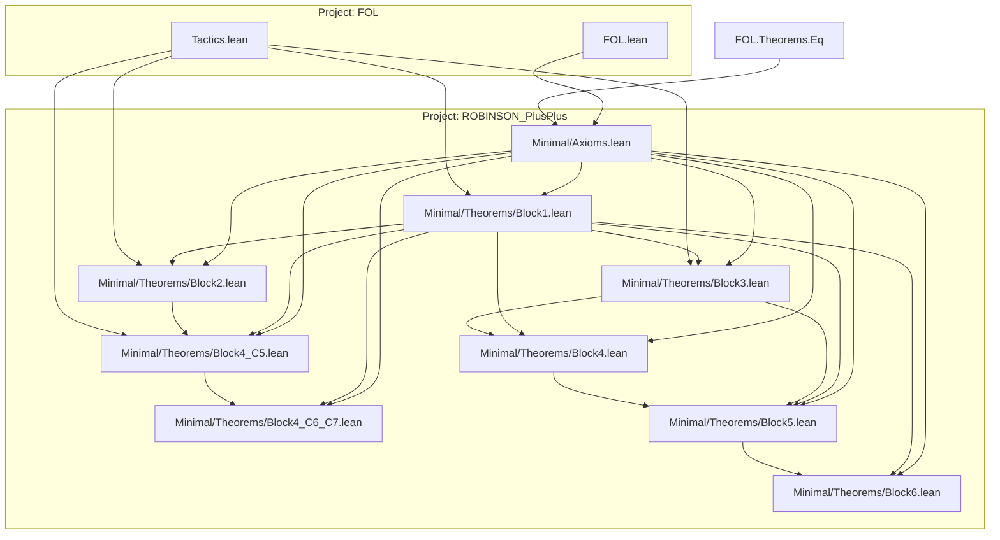

# Technical Reference — ROBINSON_PlusPlus

**Last updated:** 2026-05-11
**Author**: Julián Calderón Almendros
**Lean version**: v4.29.1

---

## 0. Naming Conventions Guide for the Reader

This project adopts [Mathlib](https://leanprover-community.github.io/contribute/naming.html)-style naming conventions.
Below are the keys for reading and searching theorems.

### 0.1 Capitalization Rules

- **Theorems/lemmas** (Prop): `snake_case` — `union_comm`, `mem_powerset_iff`
- **Prop definitions** (predicates): `UpperCamelCase` — `IsNat`, `IsFunction`; in theorem names → `lowerCamelCase`: `isNat_zero`
- **Functions** (returning values): `lowerCamelCase` — `powerset`, `union`, `sUnion`
- **Acronyms**: as group — `ZFC` (namespace), `zfc` (in snake_case)

### 0.2 Symbol-to-Word Dictionary

| Symbol | Name | | Symbol | Name | | Symbol | Name |
|--------|------|---|--------|------|---|--------|------|
| ∈ | `mem` | | ∪ | `union` | | + | `add` |
| ∉ | `not_mem` | | ∩ | `inter` | | * | `mul` |
| ⊆ | `subset` | | ⋃ | `sUnion` | | - | `sub`/`neg` |
| ⊂ | `ssubset` | | ⋂ | `sInter` | | / | `div` |
| 𝒫 | `powerset` | | \ | `sdiff` | | ^ | `pow` |
| σ | `succ` | | △ | `symmDiff` | | ∣ | `dvd` |
| ∅ | `empty` | | ᶜ | `compl` | | ≤ | `le` |
| = | `eq` | | ⟂ | `disjoint` | | < | `lt` |
| ≠ | `ne` | | ↔ | `iff` | | 0 | `zero` |
| ¬ | `not` | | → | `of` | | 1 | `one` |

### 0.3 Theorem Name Structure

- **Conclusion first**: `isNat_succ_of_isNat` — conclusion (`isNat_succ`) before hypotheses (`of_isNat`) with `_of_`
- **Biconditionals**: suffix `_iff` — `mem_powerset_iff` (∈ 𝒫 ↔ ⊆)
- **Directions of an iff**: `.mp` (→) and `.mpr` (←) — `mem_powerset_iff.mp`
- **Specifications**: `mem_X_iff` — `mem_succ_iff`, `mem_inter_iff`, `mem_union_iff`

### 0.4 Axiomatic Suffixes

| Suffix | Meaning | | Suffix | Meaning |
|--------|---------|---|--------|---------|
| `_comm` | commutativity | | `_self` | op with itself |
| `_assoc` | associativity | | `_left`/`_right` | lateral variant |
| `_refl` | reflexivity | | `_cancel` | cancellation |
| `_trans` | transitivity | | `_mono` | monotonicity |
| `_antisymm` | antisymmetry | | `_inj` | injectivity (iff) |
| `_symm` | symmetry | | `_injective` | injectivity (pred) |

### 0.5 Naming Migration Status

*(Update this section as the project evolves. Example:)*

🔄 **Fase 1 en progreso** (2026-05-08): Módulos iniciales creados.

---

## 📋 Compliance with AI-GUIDE.md

This document complies with all requirements specified in `AI-GUIDE.md`:

✅ **(1)** All `.lean` modules documented in section 1.1
✅ **(2)** Dependencies between modules (table with dependencies column)
✅ **(3)** Namespaces and relationships (table with namespace column)
✅ **(4)** Definitions with location, namespace, and declaration order
✅ **(5)** Axioms and definitions with:

- Human-readable mathematical notation
- Lean 4 signature for code usage
- Explicit dependencies
✅ **(6)** Main theorems without proof with:
- Human-readable mathematical notation
- Lean 4 signature for code usage
- Explicit dependencies
✅ **(7)** Only proven/constructed content (no pending items)
✅ **(8)** Continuous update when loading `.lean` files
✅ **(9)** Self-sufficient as sole reference (no need to load entire project)

---

## 1. Module Overview

### 1.1 Module Table

| Module | Namespace | Dependencies | Status |
|--------|-----------|--------------|--------|
| `Minimal/Axioms.lean` | `ROBINSON_PlusPlus.Minimal.Axioms` | `FOL.FOL`, `FOL.Theorems.Eq` | 🔄 In progress |
| `Minimal/Theorems/Block1.lean` | `ROBINSON_PlusPlus.Minimal.Theorems.Block1` | `Minimal.Axioms`, `FOL.Tactics` | 🔄 In progress |
| `Minimal/Theorems/Block2.lean` | `ROBINSON_PlusPlus.Minimal.Theorems.Block2` | `Minimal.Axioms`, `Minimal.Theorems.Block1` | 🔄 In progress |
| `Minimal/Theorems/Block3.lean` | `ROBINSON_PlusPlus.Minimal.Theorems.Block3` | `Minimal.Axioms`, `Minimal.Theorems.Block1` | 🔄 In progress |
| `Minimal/Theorems/Block4.lean` | `ROBINSON_PlusPlus.Minimal.Theorems.Block4` | `Minimal.Axioms`, `Block1`, `Block3` | 🔄 In progress |
| `Minimal/Theorems/Block4_C5.lean` | `ROBINSON_PlusPlus.Minimal.Theorems.Block4_C5` | `Minimal.Axioms`, `Block1`, `Block2` | 🔄 In progress |
| `Minimal/Theorems/Block4_C6_C7.lean` | `ROBINSON_PlusPlus.Minimal.Theorems.Block4_C6_C7` | `Minimal.Axioms`, `Block1`, `Block4_C5` | 🔄 In progress |
| `Minimal/Theorems/Block5.lean` | `ROBINSON_PlusPlus.Minimal.Theorems.Block5` | `Minimal.Axioms`, `Block1`, `Block3`, `Block4` | 🔄 In progress |
| `Minimal/Theorems/Block6.lean` | `ROBINSON_PlusPlus.Minimal.Theorems.Block6` | `Minimal.Axioms`, `Block1`, `Block5` | 🔄 In progress |

*Status codes*: ✅ Complete · 🧊 Frozen · 🔶 Partial · 🔄 In progress · ❌ Pending

---

## 2. Dependency Graph



*(Update this diagram as modules are added)*

---

## 3. Module Descriptions

### 3.1 Prelim.lean

**Namespace**: top-level (no namespace wrapper)
**Dependencies**: `Init.Classical`
**Last updated**: 2026-04-20 00:00
**Status**: ✅ Completo
**@axiom_system**: `none`
**@importance**: `foundational`

Foundational infrastructure used by all modules: custom `ExistsUnique` with full API,
both `∃!` and `∃¹` notations, dot-notation style and Peano-compatible aliases.

#### ExistsUnique

**Mathematical statement**: p has a unique witness iff ∃ x, p x ∧ ∀ y, p y → y = x

**Lean 4 signature**:

```lean
def ExistsUnique {α : Sort u} (p : α → Prop) : Prop :=
  ∃ x, p x ∧ ∀ y, p y → y = x
```

**Computability**: noncomputable (witness extraction uses `Classical.choose`)
**Dependencies**: `Init.Classical`

**Full API**:

| Name (dot-notation) | Peano alias | Description |
|---------------------|-------------|-------------|
| `ExistsUnique.intro w hw h` | — | constructor |
| `ExistsUnique.exists h` | `ExistsUnique.exists h` | extracts `∃ x, p x` |
| `ExistsUnique.choose h` | `choose_unique h` | noncomputable witness |
| `ExistsUnique.choose_spec h` | `choose_spec_unique h` | witness satisfies p |
| `ExistsUnique.unique h y hy` | `choose_uniq h hy` | uniqueness: `y = witness` |

---

### 3.2 FOL.lean

**Namespace**: top-level
**Dependencies**: none
**Last updated**: 2026-04-21
**Status**: ✅ Completo
**@axiom_system**: `classical`
**@importance**: `foundational`

Provides the core syntax, substitution operations using De Bruijn indices, AST navigation, and the Natural Deduction system with a local rewrite rule mechanism.

**Definitions**:

- `Term`: Inductive type for terms (variables via `#n` and functions).
- `Formula`: Inductive type for formulas (`⊥`, `atom`, `⇒`, `∀.`).
- `neg`, `top`, `lor`, `land`, `iff`, `ex`: Derived logical connectives.
- `liftTerm`, `liftTerms`, `liftFormula`: De Bruijn lifting.
- `substTerm`, `substTerms`, `substFormula`: Substitution of De Bruijn indices.
- `Pos`: Abstract Syntax Tree position path for subformula targeting.
- `getAt?`, `replaceAt`: Operations to query and modify formulas at exact positions.
- `LocalRule`: Allows localized rewrites (e.g., double negation elimination).
- `Derives`: Inductive predicate `Γ ⊢ f` representing natural deduction derivations.

**Notations**:

- `⊥` => `Formula.bottom`
- `⊤` => `top`
- `¬` => `neg`
- ` ∧ ` => `land`
- ` ∨ ` => `lor`
- ` ⇒ ` => `Formula.impl`
- ` ⇔ ` => `iff`
- `∀.` => `Formula.forall`
- `∃.` => `ex`
- `#` => `Term.var`
- ` ⊢ ` => `Derives`

---

### 3.3 Theorems/Impl.lean

**Namespace**: `FOL.Theorems.Impl`
**Dependencies**: `FOL.FOL`, `FOL.Prelim`
**Last updated**: 2026-04-21
**Status**: ✅ Completo
**@axiom_system**: `none`
**@importance**: `high`

Tautologies of implication.

**Theorems**:

- `id_impl`: $A \Rightarrow A$
  `theorem id_impl {Γ A} : Γ ⊢ .impl A A`
- `k_impl`: $A \Rightarrow (B \Rightarrow A)$
  `theorem k_impl {Γ A B} : Γ ⊢ .impl A (.impl B A)`
- `syllogism_impl`: $(A \Rightarrow B) \Rightarrow ((B \Rightarrow C) \Rightarrow (A \Rightarrow C))$
  `theorem syllogism_impl {Γ A B C} : Γ ⊢ .impl (.impl A B) (.impl (.impl B C) (.impl A C))`
- `s_impl`: $(A \Rightarrow (B \Rightarrow C)) \Rightarrow ((A \Rightarrow B) \Rightarrow (A \Rightarrow C))$
  `theorem s_impl {Γ A B C} : Γ ⊢ .impl (.impl A (.impl B C)) (.impl (.impl A B) (.impl A C))`

---

### 3.4 Theorems/Neg.lean

**Namespace**: `FOL.Theorems.Neg`
**Dependencies**: `FOL.FOL`, `FOL.Prelim`
**Last updated**: 2026-04-21
**Status**: ✅ Completo
**@axiom_system**: `classical`
**@importance**: `high`

Properties of negation, explosion, and contrapositive laws.

**Theorems**:

- `explosion_impl`: $\perp \Rightarrow A$
  `theorem explosion_impl {Γ A} : Γ ⊢ .impl ⊥ A`
- `double_neg_intro`: $A \Rightarrow \neg(\neg A)$
  `theorem double_neg_intro {Γ A} : Γ ⊢ .impl A (neg (neg A))`
- `double_neg_elim`: $\neg(\neg A) \Rightarrow A$
  `theorem double_neg_elim {Γ A} : Γ ⊢ .impl (neg (neg A)) A`
- `contrapositive_1`: $(A \Rightarrow B) \Rightarrow (\neg B \Rightarrow \neg A)$
  `theorem contrapositive_1 {Γ A B} : Γ ⊢ .impl (.impl A B) (.impl (neg B) (neg A))`
- `contrapositive_2`: $(\neg B \Rightarrow \neg A) \Rightarrow (A \Rightarrow B)$
  `theorem contrapositive_2 {Γ A B} : Γ ⊢ .impl (.impl (neg B) (neg A)) (.impl A B)`

---

### 3.5 Theorems/Derived.lean

**Namespace**: `FOL.Theorems.Derived`
**Dependencies**: `FOL.FOL`, `FOL.Prelim`
**Last updated**: 2026-04-21
**Status**: ✅ Completo
**@axiom_system**: `classical`
**@importance**: `high`

Properties of derived connectives ($\land$, $\lor$, $\Leftrightarrow$).

**Theorems**:

- `and_intro`: $A \Rightarrow (B \Rightarrow (A \land B))$
- `and_elim_left`: $(A \land B) \Rightarrow A$
- `and_elim_right`: $(A \land B) \Rightarrow B$
- `or_intro_left`: $A \Rightarrow (A \lor B)$
- `or_intro_right`: $B \Rightarrow (A \lor B)$
- `or_elim`: $(A \lor B) \Rightarrow ((A \Rightarrow C) \Rightarrow ((B \Rightarrow C) \Rightarrow C))$
- `excluded_middle`: $A \lor \neg A$
- `and_comm`: $(A \land B) \Rightarrow (B \land A)$
- `or_comm`: $(A \lor B) \Rightarrow (B \lor A)$
- `and_assoc`: $((A \land B) \land C) \Rightarrow (A \land (B \land C))$
- `or_assoc`: $((A \lor B) \lor C) \Rightarrow (A \lor (B \lor C))$
- `de_morgan_1_fwd`: $\neg(A \lor B) \Rightarrow (\neg A \land \neg B)$
- `de_morgan_1_rev`: $(\neg A \land \neg B) \Rightarrow \neg(A \lor B)$
- `de_morgan_1`: $\neg(A \lor B) \Leftrightarrow (\neg A \land \neg B)$
- `de_morgan_2_fwd`: $\neg(A \land B) \Rightarrow (\neg A \lor \neg B)$
- `de_morgan_2_rev`: $(\neg A \lor \neg B) \Rightarrow \neg(A \land B)$
- `de_morgan_2`: $\neg(A \land B) \Leftrightarrow (\neg A \lor \neg B)$

---

### 3.6 Theorems/Quantifiers.lean

**Namespace**: `FOL.Theorems.Quantifiers`
**Dependencies**: `FOL.FOL`, `FOL.Theorems.Impl`, `FOL.Theorems.Neg`, `FOL.Theorems.Derived`
**Last updated**: 2026-04-21
**Status**: ✅ Completo
**@axiom_system**: `classical`
**@importance**: `high`

Quantifier interactions and dualities.

**Axioms**:

- `subst_lift_cancel_formula`: `substFormula v t (liftFormula (v + 1) f) = f`
- `subst_distrib_and`: `substFormula v t (land A B) = land (substFormula v t A) (substFormula v t B)`
- `lift_distrib_and`: `liftFormula c (land A B) = land (liftFormula c A) (liftFormula c B)`

**Theorems**:

- `forall_dne`: $(\forall x. \neg \neg A) \Rightarrow (\forall x. A)$
- `forall_not_impl_exists_not`: $\neg(\forall x. A) \Rightarrow \exists x. \neg A$
- `forall_dni`: $(\forall x. A) \Rightarrow (\forall x. \neg \neg A)$
- `exists_not_impl_forall_not`: $(\exists x. \neg A) \Rightarrow \neg(\forall x. A)$
- `dual_forall_exists`: $\neg(\forall x. A) \Leftrightarrow \exists x. \neg A$
- `forall_and_impl_and_forall`: $(\forall x. A \land B) \Rightarrow (\forall x. A) \land (\forall x. B)$
- `and_forall_impl_forall_and`: $((\forall x. A) \land (\forall x. B)) \Rightarrow (\forall x. A \land B)$
- `distrib_forall_and`: $(\forall x. A \land B) \Leftrightarrow (\forall x. A) \land (\forall x. B)$

---

### 3.7 Tactics.lean

**Namespace**: top-level
**Dependencies**: `FOL.FOL`, `Lean`
**Last updated**: 2026-04-25
**Status**: ✅ Completo
**@axiom_system**: `none`
**@importance**: `high`

Metaprogramming and macros to automate repetitive natural deduction tasks.

**Tactics**:

- `derive_hyp`: Closes goals of the form `Γ ⊢ f` if `f ∈ Γ` via `Derives.hyp` and `List.Mem` resolution.
- `derive_rewrite rule at pos`: Automates the application of a local rewrite rule `LocalRule` at a specific AST position using `Derives.rewrite_at`.
- `derive_weaken thm`: Automatically weakens a theorem `thm`'s context to the current goal's context by resolving `List.Subset` goals automatically.
- `derive_raa`: Applies the Reductio ad Absurdum (`Derives.raa`) rule to change a goal `Γ ⊢ A` into `Γ, ¬A ⊢ ⊥`.

**Definitions**:

- `getAllPositions`: Extracts all valid path positions (`List Pos`) from a given `Formula`.
- `tryMem`: MetaM tactic to prove list membership automatically.

---

### 3.8 Deduction.lean

**Namespace**: `FOL.Metamath.Deduction`
**Dependencies**: `FOL.FOL`, `FOL.Tactics`
**Last updated**: 2026-04-25
**Status**: ✅ Completo
**@axiom_system**: `classical`
**@importance**: `high`

**Theorems**:

- `deduction_theorem`: $(A :: \Gamma \vdash B) \Rightarrow (\Gamma \vdash A \Rightarrow B)$
  `theorem deduction_theorem {Γ A B} (h : A :: Γ ⊢ B) : Γ ⊢ .impl A B`

---

### 3.9 Semantics.lean

**Namespace**: `FOL.Metamath.Semantics`
**Dependencies**: `FOL.FOL`
**Last updated**: 2026-04-25 20:30
**Status**: ✅ Completo
**@axiom_system**: `classical`
**@importance**: `high`

**Definitions**:

- `Model`: Evaluates logic terms and predicates. `structure Model (D : Type)`
- `evalTerm`: Evaluates a `Term` into the model's domain.
- `evalTerms`: Evaluates a list of terms.
- `shiftEnv`: Shifts De Bruijn variable environment.
- `updateEnv`: Updates variable environment at a specific depth $c$.
- `evalFormula`: Computes the truth value of a `Formula`.
- `contextSatisfies`: Checks if an environment satisfies a context $\Gamma$.
- `satisfies`: $Γ \models f$. `def satisfies (Γ : List Formula) (f : Formula) : Prop`

**Theorems**:

- Substitution & Lifting generalizations: `eval_liftTerm_ext`, `eval_liftTerms_ext`, `eval_substTerm_ext`, `eval_substTerms_ext`, `eval_liftFormula_ext`, `eval_substFormula_ext`.
- Base Semantics Lemmas: `updateEnv_zero`, `shiftEnv_updateEnv_comm`, `eval_liftFormula_zero`, `eval_substFormula_zero`, `contextSatisfies_lift_zero`.
- Rewrite Correctness: `rule_soundness`, `replaceAt_soundness`.

---

### 3.10 Soundness.lean

**Namespace**: `FOL.Metamath.Soundness`
**Dependencies**: `FOL.FOL`, `FOL.Metamath.Semantics`, `FOL.Tactics`
**Last updated**: 2026-04-25
**Status**: ✅ Completo
**@axiom_system**: `classical`
**@importance**: `high`

**Theorems**:

- `soundness`: Si $\Gamma \vdash f$, entonces $\Gamma \models f$.
  `theorem soundness {Γ f} (h : Γ ⊢ f) : Γ ⊨ f`

---

### 3.11 Minimal/Axioms.lean

**Namespace**: `ROBINSON_PlusPlus.Minimal.Axioms`
**Dependencies**: `FOL.FOL`, `FOL.Theorems.Eq`
**Last updated**: 2026-05-11
**Status**: 🔄 In progress (helpers con sorry)
**@axiom_system**: `Minimal`
**@importance**: `foundational`

Define el lenguaje, los 30 axiomas del sistema minimal de aritmética y los helpers meta-nivel que se usan en todos los módulos Block*.

---

#### 3.11.1 Notations

| Notation | Priority | Expands to |
|----------|----------|------------|
| `t₁ =eq t₂` | 50 | `Formula.eq t₁ t₂` |
| `t₁ ≤ t₂` | 50 | `le t₁ t₂` (= `lt t₁ t₂ ∨ t₁ =eq t₂`) |
| `x ∈ l` | 50 | `In x l` (= `Formula.atom "∈" [x, l]`) |
| `abbrev ex` | — | `@Formula.ex` |

---

#### 3.11.2 Language Symbols (Strings)

| Name | Value | Role |
|------|-------|------|
| `succ_sym` | `"σ"` | function |
| `add_sym` | `"+"` | function |
| `mul_sym` | `"*"` | function |
| `sqrt_sym` | `"√"` | function |
| `div2_sym` | `"/₂"` | function |
| `mod2_sym` | `"%₂"` | function |
| `proj1_sym` | `"π₁"` | function |
| `proj2_sym` | `"π₂"` | function |
| `pred_sym` | `"τ"` | function |
| `nil_sym` | `"[]"` | function |
| `cons_sym` | `"::"` | function |
| `concat_sym` | `"##"` | function |
| `lt_sym` | `"<"` | predicate |
| `in_sym` | `"∈"` | predicate |
| `zero_sym` | `"0"` | constant |

---

#### 3.11.3 Term Constructors

All definitions: computable, no termination proof.

| Name | Lean signature | Math |
|------|---------------|------|
| `zero` | `def zero : Term` | $0$ |
| `succ t` | `def succ (t : Term) : Term` | $\sigma(t)$ |
| `add t₁ t₂` | `def add (t₁ t₂ : Term) : Term` | $t_1 + t_2$ |
| `mul t₁ t₂` | `def mul (t₁ t₂ : Term) : Term` | $t_1 \cdot t_2$ |
| `sqrt t` | `def sqrt (t : Term) : Term` | $\sqrt{t}$ |
| `div2 t` | `def div2 (t : Term) : Term` | $\lfloor t/2 \rfloor$ |
| `mod2 t` | `def mod2 (t : Term) : Term` | $t \bmod 2$ |
| `proj1 t` | `def proj1 (t : Term) : Term` | $\pi_1(t)$ |
| `proj2 t` | `def proj2 (t : Term) : Term` | $\pi_2(t)$ |
| `pred t` | `def pred (t : Term) : Term` | $\tau(t)$ |
| `Cons h t` | `def Cons (h t : Term) : Term` | $h :: t$ |
| `concat l₁ l₂` | `def concat (l₁ l₂ : Term) : Term` | $l_1 \,\#\#\, l_2$ |
| `sq t` | `def sq (t : Term) : Term` | $t^2$ (= `mul t t`) |
| `one` | `def one : Term` | $1$ (= `succ zero`) |
| `two` | `def two : Term` | $2$ (= `succ one`) |
| `eight` | `def eight : Term` | $8$ (= `mul two (mul two two)`) |
| `cantor_poly x y` | `def cantor_poly (x y : Term) : Term` | $(x+y)(x+y+1) + 2y$ |
| `cantor_func x y` | `def cantor_func (x y : Term) : Term` | $\lfloor ((x+y)(x+y+1)+2y)/2 \rfloor$ |
| `pair x y` | `def pair (x y : Term) : Term` | $\langle x,y \rangle$ (= `cantor_func x y`) |
| `Nil` | `def Nil : Term` | $[]$ (= `zero`) |

---

#### 3.11.4 Formula Constructors

| Name | Lean signature | Math |
|------|---------------|------|
| `lt t₁ t₂` | `def lt (t₁ t₂ : Term) : Formula` | $t_1 < t_2$ |
| `le t₁ t₂` | `def le (t₁ t₂ : Term) : Formula` | $t_1 \le t_2$ (= `lt t₁ t₂ ∨ t₁ =eq t₂`) |
| `In x l` | `def In (x l : Term) : Formula` | $x \in l$ |
| `is_cantor x y c` | `def is_cantor (x y c : Term) : Formula` | $2c = (x+y)(x+y+1)+2y$ |
| `forall_ f` | `def forall_ (f : Formula) : Formula` | $\forall x.\, f$ |
| `forall_2 f` | `def forall_2 (f : Formula) : Formula` | $\forall x\,y.\, f$ |
| `forall_3 f` | `def forall_3 (f : Formula) : Formula` | $\forall x\,y\,z.\, f$ |
| `land A B` | `def land (A B : Formula) : Formula` | $A \land B$ (alias `Formula.and`) |
| `lor A B` | `def lor (A B : Formula) : Formula` | $A \lor B$ (alias `Formula.or`) |

---

#### 3.11.5 Display

```lean
partial def termToString : Term → String
instance : ToString Term
```

---

#### 3.11.6 Axiom Formulas

All axiom formulas are `def`s of type `Formula`. Variables use De Bruijn indices: `.var 0` is the innermost bound variable.

| Name | Lean name | Mathematical statement |
|------|-----------|----------------------|
| Ax 2 | `ax2_peano_succ_neq_zero` | $\forall n,\; \sigma(n) \neq 0$ |
| Ax 3 | `ax3_peano_succ_inj` | $\forall n\,m,\; \sigma(n)=\sigma(m) \Rightarrow n=m$ |
| Ax 4 | `ax4_add_zero` | $\forall n,\; n+0=n$ |
| Ax 5 | `ax5_add_succ` | $\forall n\,m,\; n+\sigma(m)=\sigma(n+m)$ |
| Ax 6 | `ax6_add_comm` | $\forall n\,m,\; n+m=m+n$ |
| Ax 7 | `ax7_add_assoc` | $\forall n\,m\,k,\; (n+m)+k=n+(m+k)$ |
| Ax 8 | `ax8_mul_zero` | $\forall n,\; n\cdot 0=0$ |
| Ax 9 | `ax9_mul_succ` | $\forall n\,m,\; n\cdot\sigma(m)=(n\cdot m)+n$ |
| Ax 10 | `ax10_mul_comm` | $\forall n\,m,\; n\cdot m=m\cdot n$ |
| Ax 11 | `ax11_mul_assoc` | $\forall n\,m\,k,\; (n\cdot m)\cdot k=n\cdot(m\cdot k)$ |
| Ax 12 | `ax12_mul_distrib` | $\forall n\,m\,k,\; n\cdot(m+k)=(n\cdot m)+(n\cdot k)$ |
| Ax 13 | `ax13_lt_def` | $\forall n\,m,\; n<m \Leftrightarrow \exists k,\; n+\sigma(k)=m$ |
| Ax 14 | `ax14_sqrt_le` | $\forall n,\; (\sqrt{n})^2 \le n$ |
| Ax 15 | `ax15_lt_succ_sqrt` | $\forall n,\; n < (\sigma(\sqrt{n}))^2$ |
| Ax 16 | `ax16_mod2_succ` | $\forall n,\; \%_2(n)=0 \Leftrightarrow \%_2(\sigma(n))=1$ |
| Ax 17 | `ax17_div_mod_eq` | $\forall n,\; (/_2(n)\cdot 2)+\%_2(n)=n$ |
| Ax 18 | `ax18_lt_irrefl` | $\forall n,\; \lnot(n<n)$ |
| Ax 19 | `ax19_lt_trichotomy` | $\forall a\,b,\; a<b \lor a=b \lor b<a$ |
| Ax 21 | `ax21_mod2_range` | $\forall n,\; \%_2(n)=0 \lor \%_2(n)=1$ |
| Ax 22 | `ax22_cantor_proj_exists` | $\forall c,\; \text{is\_cantor}(\pi_1(c),\pi_2(c),c)$ (postulated) |
| Ax 23 | `ax23_cantor_proj_uniq` | $\forall c\,x\,y\,x'\,y',\; \text{is\_cantor}(x,y,c)\land\text{is\_cantor}(x',y',c)\Rightarrow x=x'\land y=y'$ (postulated) |
| Ax 24 | `ax24_mod2_of_even` | $\forall n\,k,\; n=2k \Rightarrow \%_2(n)=0$ (postulated) |
| Ax 25 | `ax25_tau_zero` | $\tau(0)=0$ |
| Ax 26 | `ax26_tau_succ` | $\forall n,\; \tau(\sigma(n))=n$ |
| Ax L0 | `ax_L0_cons_def` | $\forall h\,t,\; h::t = \langle h, \sigma(t)\rangle$ |
| Ax L1 | `ax_L1_in_nil` | $\forall x,\; \lnot(x\in[])$ |
| Ax L2 | `ax_L2_in_cons` | $\forall x\,h\,t,\; x\in(h::t) \Leftrightarrow x=h \lor x\in t$ |
| Ax C1 | `ax_C1_concat_nil` | $\forall l,\; []\,\#\#\,l = l$ |
| Ax C2 | `ax_C2_concat_cons` | $\forall h\,t\,l,\; (h::t)\,\#\#\,l = h::(t\,\#\#\,l)$ |
| Ax 27 | `ax27_add_left_cancel` | $\forall a\,b\,c,\; a+c=b+c \Rightarrow a=b$ (postulated) |

> Ax 1 ($\exists 0$) es meta-axiomático: `zero : Term`.
> Ax 20 ($\forall n\,m, n=m \lor n\neq m$) es el teorema `eq_decidable` en Block1.lean.

**Axiom set**:

```lean
def axioms : List Formula
```

Contains all 30 axioms above (ax2 – ax27, axL0–axL2, axC1–axC2) ordered as in the source file.

---

#### 3.11.7 Helper Theorems / Definitions (meta-level)

All operate over any context `Γ : List Formula`.

| Name | Lean signature | Math | Sorry |
|------|---------------|------|-------|
| `ax` | `theorem ax {f} (h : f ∈ axioms) : axioms ⊢ f` | Membership → derivation | ✅ |
| `spec` | `theorem spec {A} (h : Γ ⊢ ∀.A) (t : Term) : Γ ⊢ substFormula 0 t A` | $\forall$-elim | ✅ |
| `eq_refl` | `theorem eq_refl (t : Term) : Γ ⊢ t ≐ t` | $t = t$ | ✅ |
| `eq_symm` | `theorem eq_symm (h : Γ ⊢ t₁ ≐ t₂) : Γ ⊢ t₂ ≐ t₁` | symmetry | ✅ |
| `eq_trans` | `theorem eq_trans (h1 : Γ ⊢ t₁≐t₂) (h2 : Γ ⊢ t₁≐t₃) : Γ ⊢ t₂≐t₃` | non-std trans | ✅ |
| `eq_congr_succ` | `theorem eq_congr_succ (h : Γ ⊢ t₁≐t₂) : Γ ⊢ succ t₁ ≐ succ t₂` | cong σ | ✅ |
| `mp` | `def mp (h1 : Γ ⊢ A⇒B) (h2 : Γ ⊢ A) : Γ ⊢ B` | modus ponens | ✅ |
| `imp_intro` | `theorem imp_intro (h : Γ ⊢ A → Γ ⊢ B) : Γ ⊢ A⇒B` | impl intro | sorry |
| `gen` | `theorem gen (h : ∀ n, Γ ⊢ substFormula 0 n A) : Γ ⊢ ∀.A` | ∀-intro | sorry |
| `raa` | `theorem raa (h : Γ ⊢ A → Γ ⊢ ⊥) : Γ ⊢ ¬A` | RAA | sorry |
| `and_intro` | `def and_intro (h1 : Γ ⊢ A) (h2 : Γ ⊢ B) : Γ ⊢ A∧B` | ∧-intro | ✅ |
| `and_elim_left` | `def and_elim_left (h : Γ ⊢ A∧B) : Γ ⊢ A` | ∧-elim left | ✅ |
| `and_elim_right` | `def and_elim_right (h : Γ ⊢ A∧B) : Γ ⊢ B` | ∧-elim right | ✅ |
| `or_intro_left` | `def or_intro_left (h : Γ ⊢ A) : Γ ⊢ A∨B` | ∨-intro left | ✅ |
| `or_intro_right` | `def or_intro_right (h : Γ ⊢ B) : Γ ⊢ A∨B` | ∨-intro right | ✅ |
| `or_elim` | `theorem or_elim (h : Γ ⊢ A∨B) (h1 : Γ ⊢ A→Γ ⊢ C) (h2 : Γ ⊢ B→Γ ⊢ C) : Γ ⊢ C` | ∨-elim | sorry |
| `false_elim` | `def false_elim (h : Γ ⊢ ⊥) : Γ ⊢ A` | ex falso | ✅ |
| `ex_intro` | `def ex_intro (t) (h : Γ ⊢ substFormula 0 t A) : Γ ⊢ ∃.A` | ∃-intro | ✅ |
| `ex_elim` | `theorem ex_elim (h : Γ ⊢ ∃.A) (cont : ∀ t, Γ ⊢ substFormula 0 t A → Γ ⊢ C) : Γ ⊢ C` | ∃-elim | sorry |
| `iff_mp` | `def iff_mp (h1 : Γ ⊢ A⇔B) (h2 : Γ ⊢ A) : Γ ⊢ B` | ↔ mp | ✅ |
| `iff_mpr` | `def iff_mpr (h1 : Γ ⊢ A⇔B) (h2 : Γ ⊢ B) : Γ ⊢ A` | ↔ mpr | ✅ |
| `eq_subst` | `theorem eq_subst (heq : Γ ⊢ t₁≐t₂) (hp : Γ ⊢ A) : Γ ⊢ A` | eq subst | sorry |
| `eq_symm_neg` | `theorem eq_symm_neg (h : Γ ⊢ ¬(t₂≐t₁)) : Γ ⊢ ¬(t₁≐t₂)` | neg sym | sorry |
| `eq_congr_add_left` | `theorem eq_congr_add_left (h : Γ ⊢ t₁≐t₂) : Γ ⊢ add u t₁ ≐ add u t₂` | cong + right | sorry |
| `eq_congr_add_right` | `theorem eq_congr_add_right (h : Γ ⊢ t₁≐t₂) : Γ ⊢ add t₁ u ≐ add t₂ u` | cong + left | sorry |
| `eq_congr_mul_left` | `theorem eq_congr_mul_left (h : Γ ⊢ t₁≐t₂) : Γ ⊢ mul u t₁ ≐ mul u t₂` | cong * right | sorry |
| `eq_congr_mul_right` | `theorem eq_congr_mul_right (h : Γ ⊢ t₁≐t₂) : Γ ⊢ mul t₁ u ≐ mul t₂ u` | cong * left | sorry |

**CoeFun instance**: `Derives Γ (A⇒B)` coerces to `Derives Γ A → Derives Γ B`.

> **Simp patterns** (confirmed working in Block2.lean):
>
> - Ax13 (tiene `⇔`): `simp [ax13_lt_def, forall_2, substFormula, substTerm, substTerms, liftTerm, liftTerms, lt, add, succ, iff, FOL.substTerm_liftTerm] at h`
> - Ax19 (sin `⇔`): `simp [ax19_lt_trichotomy, forall_2, substFormula, substTerm, substTerms, liftTerm, liftTerms, lt, succ, FOL.substTerm_liftTerm] at h`
> - Regla: añadir `iff` al simp set cuando el axioma contiene `⇔`.

> **Nombres calificados obligatorios** en módulos que importan `FOL.Theorems.Derived`:
> `ROBINSON_PlusPlus.Minimal.Axioms.or_intro_left`, `or_intro_right`, `or_elim`
> (hay ambigüedad con `FOL.Theorems.Derived.or_intro_left` que es implicación objeto-nivel).

---

### 3.12 Minimal/Theorems/Block1.lean

**Namespace**: `ROBINSON_PlusPlus.Minimal.Theorems.Block1`
**Dependencies**: `Minimal.Axioms`, `FOL.Tactics`, `FOL.Theorems.*`
**Last updated**: 2026-05-11
**Status**: 🔄 In progress (25 sorry)
**@axiom_system**: `Minimal`
**@importance**: `high`

Demostraciones de los teoremas de aritmética básica (Bloque I).

#### Fase 1: Evaluación de Constantes (Teo 1.1 - 1.13)

*(13 teoremas, incluyendo `zero_ne_one`, `one_add_one_eq_two`, etc.)*

#### Fase 2: Identidades del 0 y del 1 (Teo 2.1 - 2.11)

*(11 teoremas, incluyendo `add_zero`, `zero_add`, `mul_one`, `one_mul`, `succ_eq_add_one`, `add_eq_zero_iff`, `mul_eq_zero_iff`)*

#### Fase 3: Orden Estricto y No Estricto (Teo 3.1 - 3.11)

**Theorems**:

- `lt_succ_self`: $\forall n, n < \sigma(n)$
- `zero_lt_one`, `one_lt_two`, `zero_lt_two`: Instancias de orden.
- `lt_irrefl`: $\forall n, \neg(n < n)$
- `ne_of_lt`: $n < m \Rightarrow n \neq m$
- `zero_le`: $\forall n, 0 \le n$
- `lt_trans`: $n < m \land m < p \Rightarrow n < p$
- `lt_asymm`: $n < m \Rightarrow \neg(m < n)$
- `le_antisymm`: $n \le m \land m \le n \Rightarrow n = m$
- `lt_add_succ`: $\forall n, k, n < n + \sigma(k)$
- `exists_pred_of_ne_zero`: $n \neq 0 \Rightarrow \exists m, \sigma(m) = n$

---

### 3.13 Minimal/Theorems/Block2.lean

**Namespace**: `ROBINSON_PlusPlus.Minimal.Theorems.Block2`
**Dependencies**: `Minimal.Axioms`, `Minimal.Theorems.Block1`, `FOL.Tactics`
**Last updated**: 2026-05-11
**Status**: 🔄 In progress (12 sorry)
**@axiom_system**: `Minimal`
**@importance**: `high`

Demostraciones de los teoremas sobre la raíz cuadrada (Bloque II).

#### Fase 4: Cotas y Unicidad de √ (Teo 4.1 - 4.6)

**Theorems**:

- `sqrt_sq_le`: $\forall n, (\sqrt{n})^2 \le n$
- `lt_succ_sqrt_sq`: $\forall n, n < (\sigma(\sqrt{n}))^2$
- `sq_eq_zero_imp_zero`: $n^2 = 0 \Rightarrow n = 0$
- `sqrt_zero`: $\sqrt{0} = 0$
- `sqrt_one`: $\sqrt{1} = 1$
- `sqrt_unique_of_bounds`: $k^2 \le n \land n < (k+1)^2 \Rightarrow k = \sqrt{n}$
- `succ_le_of_lt`: $a < b \Rightarrow \sigma(a) \le b$ (Teorema derivable)
- `sq_le_mono`: $a \le b \Rightarrow a^2 \le b^2$ (Teorema derivable, prueba omitida por longitud)

---

### 3.14 Minimal/Theorems/Block3.lean

**Namespace**: `ROBINSON_PlusPlus.Minimal.Theorems.Block3`
**Dependencies**: `Minimal.Axioms`, `Minimal.Theorems.Block1`
**Last updated**: 2026-05-11
**Status**: 🔄 In progress (11 sorry)
**@axiom_system**: `Minimal`
**@importance**: `high`

Demostraciones de los teoremas sobre `div2` y `mod2` (Bloque III).

#### Fase 5: Valores de div2 y mod2 (Teo 5.1 - 5.10)

**Theorems**:

- `mod2_zero`: $mod2(0) = 0$
- `div2_zero`: $div2(0) = 0$
- `mod2_one`: $mod2(1) = 1$
- `div2_one`: $div2(1) = 0$
- `mod2_two`: $mod2(2) = 0$
- `div2_two`: $div2(2) = 1$
- `mod2_three`: $mod2(3) = 1$
- `div2_three`: $div2(3) = 1$
- `mod2_four`: $mod2(4) = 0$
- `div2_four`: $div2(4) = 2$
- `mod2_range`: $\forall n, mod2(n) = 0 \lor mod2(n) = 1$

---

### 3.15 Minimal/Theorems/Block4.lean

**Namespace**: `ROBINSON_PlusPlus.Minimal.Theorems.Block4`
**Dependencies**: `Minimal.Axioms`, `Minimal.Theorems.Block1`, `Minimal.Theorems.Block3`
**Last updated**: 2026-05-11
**Status**: 🔄 In progress (8 sorry)
**@axiom_system**: `Minimal`
**@importance**: `high`

Demostraciones de los teoremas sobre la función de apareamiento de Cantor (Bloque IV).

#### Fase 6: Lema de Paridad (Lema P1)

**Theorems**:

- `w_mul_w_plus_one_eq_sq_w_add_w`: $\forall w, w(w+1) = w^2+w$
- `parity_lemma_case_even`: $mod2(w)=0 \Rightarrow \exists k, w(w+1)=2k$
- `parity_lemma_case_odd`: $mod2(w)=1 \Rightarrow \exists k, w(w+1)=2k$
- `parity_lemma`: $\forall w, \exists k, w(w+1)=2k$

#### Fase 7: Polinomio de Cantor y Totalidad

- `cantor_poly_term1_eq_sq_add`: $\forall x,y, (x+y)(x+y+1) = (x+y)^2+(x+y)$
- `cantor_poly_is_even`: $\forall x,y, \exists k, (x+y)(x+y+1)+2y = 2k$
- `cantor_totality`: $\forall x,y, \exists c, Cantor(x,y,c)$

#### Fase 8: Inyectividad de Cantor

- `cantor_injective_c`: $Cantor(x,y,c) \land Cantor(x,y,c') \implies c = c'$

#### Fase 9: Proyecciones de Cantor

- `mod2_of_even`: $n = 2k \implies mod2(n) = 0$ (Lema auxiliar, ahora basado en Ax 24)
- `cantor_proj1_eq_x`: $[⟨x,y⟩].1 = x$
- `cantor_proj2_eq_y`: $[⟨x,y⟩].2 = y$
- `cantor_proj_inverse`: $⟨[c].1, [c].2⟩ = c$

---

## 4. Theorems

*(See Module Descriptions in §3 for individual theorems).*
